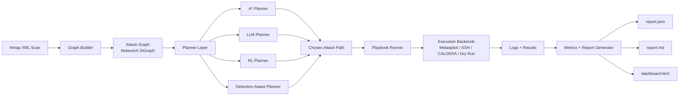
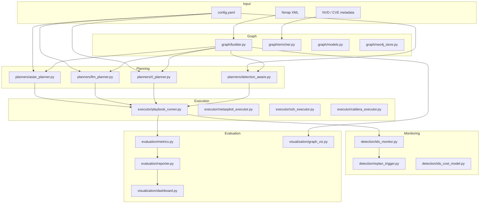
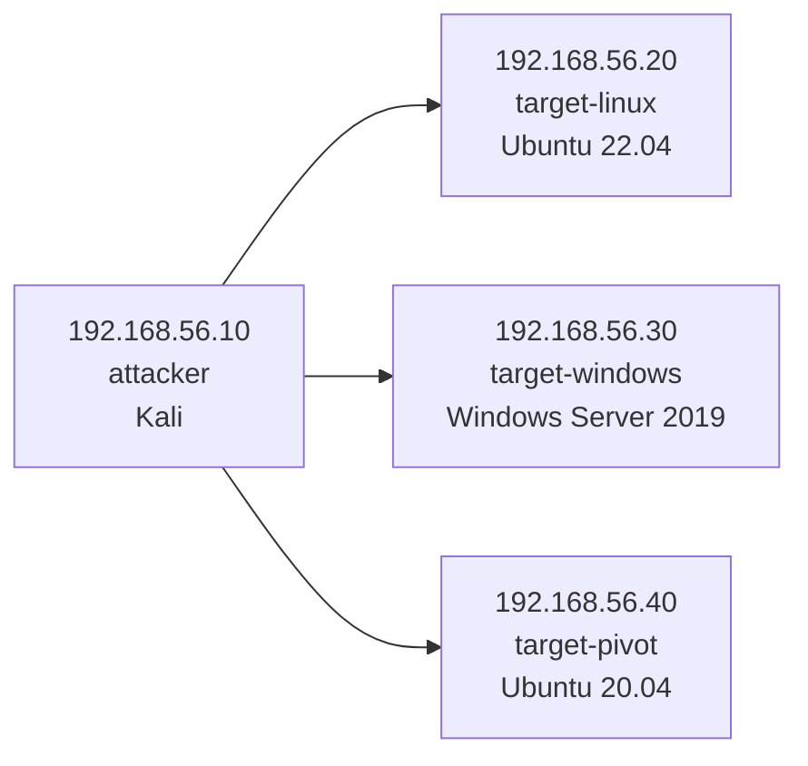
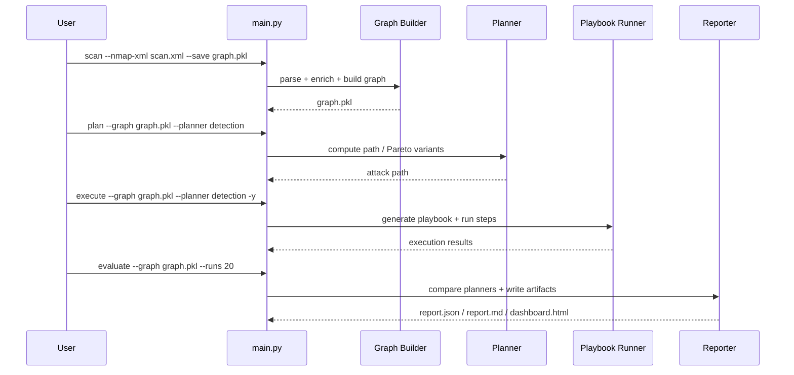
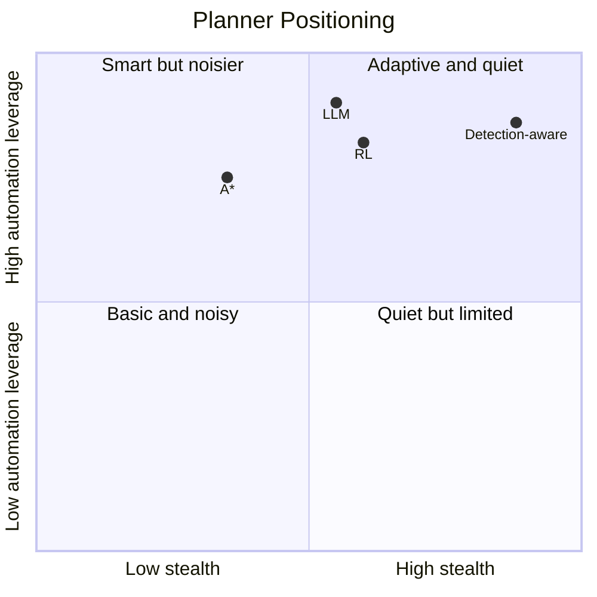
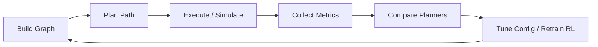

# AutoAttack

<p align="center">
  
  
  
  
  
</p>

<p align="center">
  <strong>A research-oriented automated attack planning and evaluation framework built around attack graphs, multiple planning strategies, execution playbooks, IDS-aware replanning, RL training, and visual reporting.</strong>
</p>

---

## What This Project Does

AutoAttack turns host discovery data into an actionable attack graph, selects a path to a goal host using one of four planners, optionally executes the resulting path through pluggable backends, and produces evaluation artifacts for comparing strategies.

The current codebase implements:

- Attack graph construction from Nmap XML.
- CVE enrichment and exploit-module mapping.
- Four planners: `astar`, `llm`, `rl`, and `detection`.
- AttackMate-style playbook generation and timed execution.
- RL training with a tabular Q-learning agent.
- Evaluation reports in JSON, Markdown, and offline HTML dashboard form.
- Graphviz export and Plotly-based dashboarding.
- A Vagrant lab layout for a three-host test environment.

This repository is best understood as a modular research prototype and experimentation platform, not a turnkey offensive security product.

## Why It’s Interesting

- Classical planning gives a strong deterministic baseline.
- LLM planning adds higher-level reasoning with graph-constrained validation.
- RL planning learns action preferences from repeated simulated episodes.
- Detection-aware planning introduces a stealth-versus-ease tradeoff.
- Reporting makes planner behavior comparable instead of anecdotal.

## System Flow



## Architecture



## Repository Layout

```text
.
├── main.py                   # CLI entrypoint
├── config.yaml               # Lab, planner, API, and evaluation config
├── graph/                    # Attack graph building + enrichment
├── planners/                 # A*, LLM, RL, and detection-aware planners
├── executor/                 # Execution backends + playbook runner
├── detection/                # IDS scoring, monitoring, and replanning hooks
├── rl/                       # Gym environment, Q-agent, trainer
├── evaluation/               # Metrics and report generation
├── visualization/            # Graphviz + Plotly outputs
├── lab/                      # Vagrant lab and provisioning scripts
├── tests/                    # Unit tests and fixture scan
└── plan.md                   # Full implementation and research plan
```

## Planner Comparison

| Planner | File | Core Idea | Strength | Tradeoff |
|---|---|---|---|---|
| `astar` | `planners/astar_planner.py` | Minimize exploit difficulty using CVSS-derived edge cost | Deterministic, strong baseline | Ignores stealth and learning |
| `llm` | `planners/llm_planner.py` | Ask an LLM for a path, then validate against graph edges | Flexible reasoning and replanning context | Depends on API access and prompt reliability |
| `rl` | `planners/rl_planner.py` | Greedy rollout over a learned Q-table | Can capture repeated-episode behavior | Needs training data and a saved Q-table |
| `detection` | `planners/detection_aware.py` | Optimize exploit ease and detection probability together | Explicit stealth tradeoff, Pareto options | Requires meaningful detection weights |

## Lab Topology

The default configuration and Vagrant files describe the following environment:



Configured goal host:

- `192.168.56.30` by default.

Representative vulnerable services encoded in `config.yaml`:

- Linux target: SSH and Apache examples.
- Windows target: SMBv1 and RDP examples.
- Pivot/database target: MySQL example.

## Supported Workflow



## Setup

### 1. Clone and create an environment

```bash
git clone https://github.com/Sonu0305/Automated-Attack-Planning-with-Attack-Graphs.git
cd Automated-Attack-Planning-with-Attack-Graphs
python3 -m venv .venv
source .venv/bin/activate
pip install -r requirements.txt
```

### 2. Export required environment variables

`config.yaml` uses `${VAR}` substitution, so secrets should come from the environment.

```bash
export MSF_RPC_PASSWORD="your-msfrpc-password"
export OPENAI_API_KEY="your-openai-api-key"
export NEO4J_PASSWORD="your-neo4j-password"
export NVD_API_KEY="your-nvd-api-key"   # optional but useful
```

### 3. Review configuration

Edit `config.yaml` if your network, goal host, credentials, or output directory differ from the defaults.

## CLI Commands

Top-level commands:

```bash
python3 main.py --help
```

Available subcommands:

- `scan`     Parse an Nmap XML file and optionally save the graph as a pickle.
- `plan`     Run one planner against a saved graph and optionally save the chosen path.
- `execute`  Generate a playbook and execute the chosen path.
- `evaluate` Run all planners repeatedly and generate comparison artifacts.
- `train-rl` Train the Q-learning agent and save a Q-table.
- `dashboard` Regenerate the HTML dashboard from saved report data.

## End-to-End Demo

### 1. Build the attack graph from an Nmap scan

```bash
python3 main.py scan \
  --nmap-xml tests/fixtures/scan_fixture.xml \
  --save graph.pkl
```

What this does:

- Parses the Nmap XML.
- Extracts live hosts and open services.
- Enriches services with CVEs.
- Maps exploitable CVEs to attack-graph edges.
- Saves a `networkx.DiGraph` to `graph.pkl`.

### 2. Generate a baseline path with A*

```bash
python3 main.py plan \
  --graph graph.pkl \
  --planner astar \
  --save-path results/astar_path.json
```

### 3. Generate stealth-aware alternatives

```bash
python3 main.py plan \
  --graph graph.pkl \
  --planner detection \
  --select balanced \
  --save-path results/detection_path.json
```

The detection-aware planner can expose three meaningful views:

- `fastest`
- `stealthiest`
- `balanced`

### 4. Train the RL agent

```bash
python3 main.py train-rl \
  --graph graph.pkl \
  --episodes 5000 \
  --output qtable.pkl
```

### 5. Use the learned RL policy

```bash
python3 main.py plan \
  --graph graph.pkl \
  --planner rl \
  --save-path results/rl_path.json
```

### 6. Execute a plan

```bash
python3 main.py execute \
  --graph graph.pkl \
  --planner detection \
  --yes
```

This step:

- Generates a timestamped YAML playbook.
- Applies human-like delays between actions.
- Dispatches each step through executor backends.
- Writes execution logs to `results/execution_log.jsonl`.

### 7. Compare planners

```bash
python3 main.py evaluate \
  --graph graph.pkl \
  --runs 20 \
  --output results
```

Artifacts produced:

- `results/report.json`
- `results/report.md`
- `results/dashboard.html`

### 8. Rebuild the dashboard from saved results

```bash
python3 main.py dashboard --output results
```

## Example Research Demo Narrative

One realistic way to present the project is:

1. Scan a controlled lab network and build the graph.
2. Show the baseline A* path to the goal host.
3. Switch to the detection-aware planner and compare `fastest` vs `stealthiest`.
4. Show how the RL planner behaves after training.
5. Generate a playbook and execute in dry-run or backed mode.
6. Finish with evaluation metrics and the dashboard.

That gives a clean story arc from discovery to planning to execution to comparison.

## Outputs You Can Expect

### Graph artifact

- Pickled attack graph such as `graph.pkl`.

### Path artifact

- JSON path file containing ordered steps with `source`, `target`, `cve_id`, and `module`.

Representative shape:

```json
[
  {
    "source": "192.168.56.10",
    "target": "192.168.56.20",
    "cve_id": "CVE-2021-41773",
    "module": "exploit/multi/http/apache_path_traversal"
  },
  {
    "source": "192.168.56.20",
    "target": "192.168.56.30",
    "cve_id": "CVE-2017-0144",
    "module": "exploit/windows/smb/ms17_010_eternalblue"
  }
]
```

### Playbook artifact

Generated by `executor/playbook_runner.py`:

```yaml
metadata:
  planner: detection
  total_steps: 4
steps:
  - name: Reconnaissance on 192.168.56.30
    type: shell
    command: nmap -sV -p 445 192.168.56.30
  - name: Exploit CVE-2017-0144 on 192.168.56.30
    type: metasploit
    module: exploit/windows/smb/ms17_010_eternalblue
```

### Evaluation artifacts

`evaluation/reporter.py` produces:

- Machine-readable `report.json`
- Human-readable `report.md`
- Self-contained `dashboard.html`

The dashboard generator advertises five panels:

- Planner comparison
- Pareto frontier
- RL training curve
- Attack graph heatmap
- Execution timeline

## Visual Reporting

### Planner tradeoff intuition



### Typical experiment loop



## Lab Provisioning

The `lab/` directory contains a Vagrant-based environment intended for a controlled demonstration network.

Basic lifecycle:

```bash
cd lab
vagrant up
vagrant status
vagrant ssh attacker
```

Destroy when finished:

```bash
vagrant destroy -f
```

The Vagrant topology defines:

- `attacker`: Kali Linux, intended to host tools such as Metasploit, Nmap, Snort, and Neo4j.
- `target1`: Ubuntu host with deliberately vulnerable services.
- `target2`: Windows Server host with deliberately vulnerable services.

## Testing

The repository includes unit tests for:

- Graph building
- A* planning
- LLM planner validation behavior
- Execution logic and playbook generation

Run the suite with:

```bash
pytest -q
```

The graph-building tests use the bundled fixture:

- `tests/fixtures/scan_fixture.xml`

## Configuration Notes

`config.yaml` controls:

- Lab network and host metadata
- Default goal host
- Metasploit RPC settings
- OpenAI model and retries
- Neo4j connection details
- IDS type, log path, and alert threshold
- Planner defaults and RL settings
- Evaluation run count and output directory

Notable defaults:

- OpenAI model: `gpt-4o`
- Default planner: `astar`
- RL episodes: `5000`
- Evaluation runs per planner: `20`

## What `plan.md` Adds

`plan.md` is the long-form implementation blueprint for the project. It documents:

- Research motivation and paper mapping
- The seven-layer system view
- Data models and module responsibilities
- Testing strategy
- Lab roadmap
- Evaluation framing
- Ethical and legal constraints

If you want the full design rationale behind the codebase, read `plan.md` alongside the source.

## Current Scope and Caveats

A few important expectations to set clearly:

- This codebase is strongest as a controlled-lab research framework.
- Some integrations are designed to support both real backends and dry-run simulation.
- The LLM planner requires an OpenAI API key and network access.
- The RL planner requires a previously trained `qtable.pkl`.
- Detection-aware planning is only as meaningful as the IDS scoring model behind each action.
- Real-world offensive use outside an authorized environment would be inappropriate and unsafe.

## Safe and Responsible Use

Use this project only in environments where you have explicit authorization, such as:

- Your own isolated lab
- A supervised academic testbed
- A permitted internal security experiment

Do not use it against systems, networks, or identities without clear written permission.

## Recommended Presentation Order

If you are using this for a thesis demo, project defense, or portfolio walkthrough, this order works well:

1. Start with the architecture diagram.
2. Show the lab topology and `config.yaml`.
3. Run `scan` and explain how the graph is built.
4. Compare A*, detection-aware, LLM, and RL planners.
5. Show generated path JSON and playbook YAML.
6. Run `evaluate` and open the dashboard.
7. Close with limitations, ethics, and future work.

## Future README Enhancements

Good next upgrades, if you want the repo to look even stronger on GitHub:

- Add screenshots of `dashboard.html`.
- Add a rendered attack graph PNG exported from `visualization/graph_viz.py`.
- Add a sample `results/` bundle checked into `examples/`.
- Add a short screencast or animated walkthrough.

---

## Quickstart Cheatsheet

```bash
# install
python3 -m venv .venv
source .venv/bin/activate
pip install -r requirements.txt

# build graph
python3 main.py scan --nmap-xml tests/fixtures/scan_fixture.xml --save graph.pkl

# plan
python3 main.py plan --graph graph.pkl --planner detection --select balanced

# train RL
python3 main.py train-rl --graph graph.pkl --episodes 5000 --output qtable.pkl

# execute
python3 main.py execute --graph graph.pkl --planner astar --yes

# evaluate
python3 main.py evaluate --graph graph.pkl --runs 20 --output results

# dashboard
python3 main.py dashboard --output results
```

AutoAttack gives you a compact but genuinely interesting experimentation loop: build the graph, compare planners, execute carefully, measure outcomes, and iterate.
