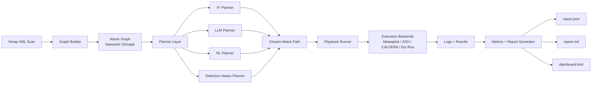
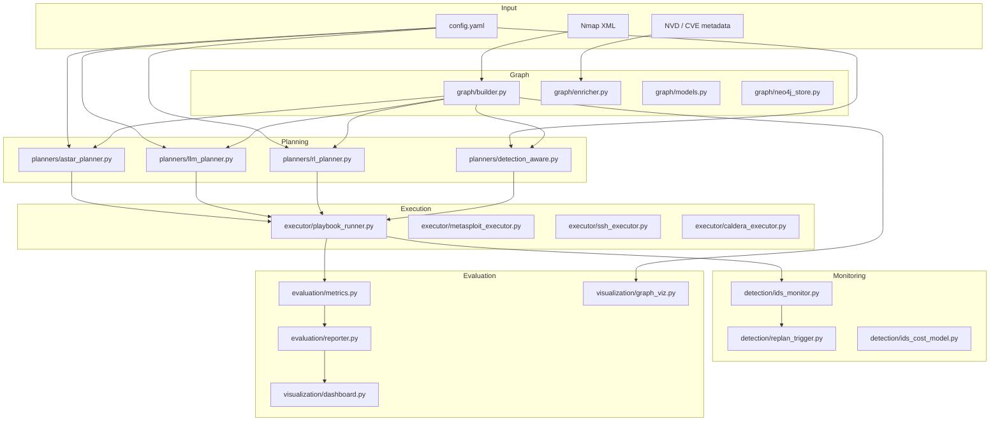
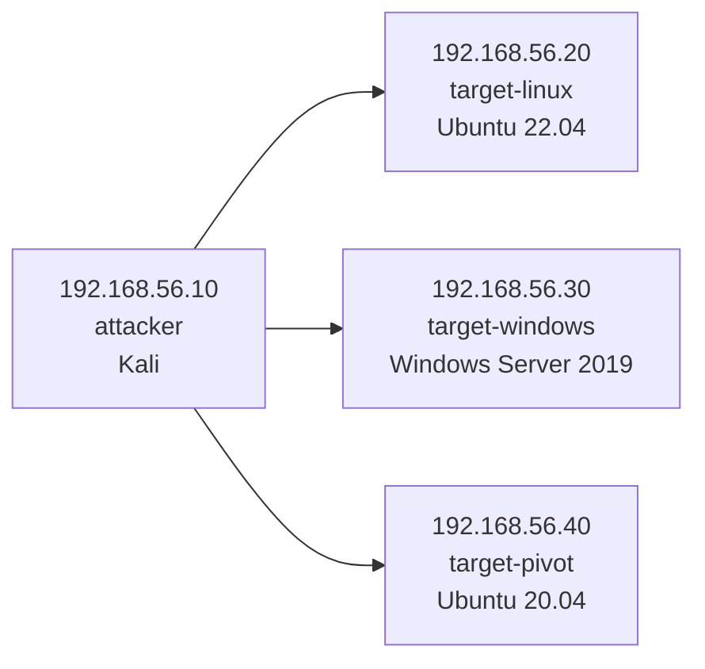
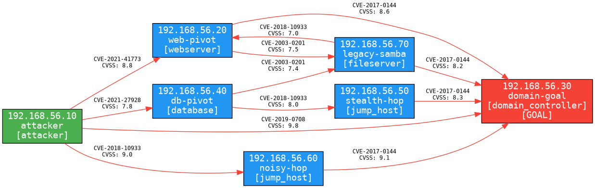
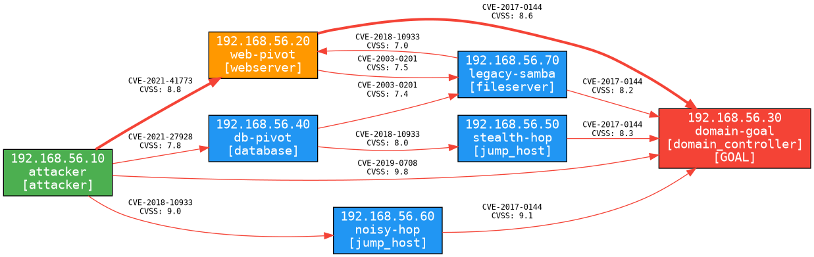
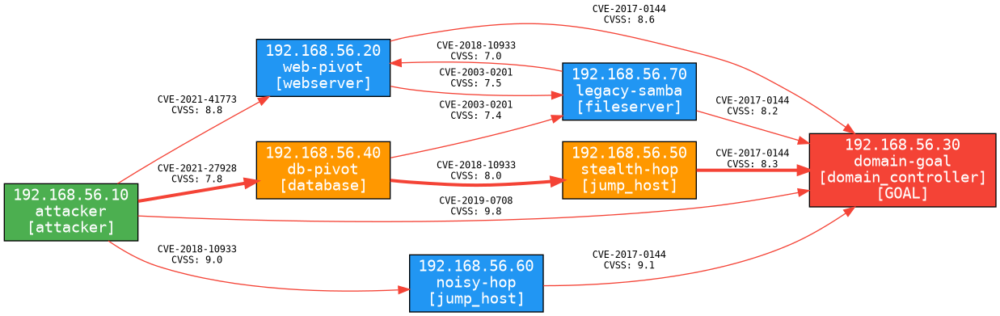
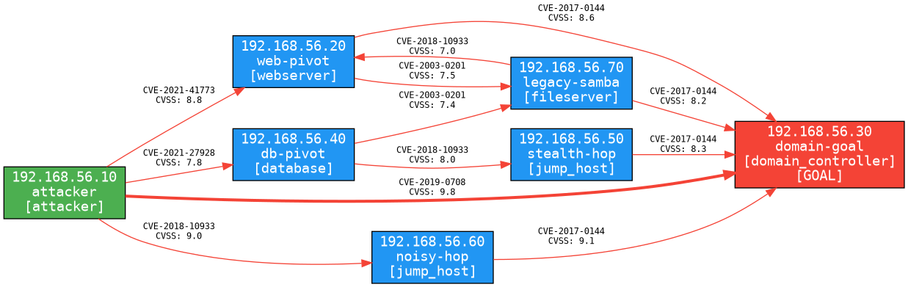

# AutoAttack

<p align="center">
  
  
  
  
  
</p>

<p align="center">
  <strong>A research-oriented automated attack planning and evaluation framework built around attack graphs, multiple planning strategies, execution playbooks, IDS-aware replanning, RL training, and visual reporting.</strong>
</p>

---

## What This Project Does

AutoAttack turns host discovery data into an actionable attack graph, selects a path to a goal host using one of four planners, optionally executes the resulting path through pluggable backends, and produces evaluation artifacts for comparing strategies.

The current codebase implements:

- Attack graph construction from Nmap XML.
- CVE enrichment and exploit-module mapping.
- Four planners: `astar`, `llm`, `rl`, and `detection`.
- AttackMate-style playbook generation and timed execution.
- RL training with a tabular Q-learning agent.
- Evaluation reports in JSON, Markdown, and offline HTML dashboard form.
- Graphviz export and Plotly-based dashboarding.
- A Vagrant lab layout for a three-host test environment.

This repository is best understood as a modular research prototype and experimentation platform, not a turnkey offensive security product.

## System Flow



## Architecture



## Repository Layout

```text
.
├── main.py                   # CLI entrypoint
├── config.yaml               # Lab, planner, API, and evaluation config
├── graph/                    # Attack graph building + enrichment
├── planners/                 # A*, LLM, RL, and detection-aware planners
├── executor/                 # Execution backends + playbook runner
├── detection/                # IDS scoring, monitoring, and replanning hooks
├── rl/                       # Gym environment, Q-agent, trainer
├── evaluation/               # Metrics and report generation
├── visualization/            # Graphviz + Plotly outputs
├── examples/                 # Checked-in benchmark bundle used in this README
├── lab/                      # Vagrant lab and provisioning scripts
├── tests/                    # Unit tests and fixture scan
└── plan.md                   # Full implementation and research plan
```

## Planner Comparison

| Planner | File | Core Idea | Strength | Tradeoff |
|---|---|---|---|---|
| `astar` | `planners/astar_planner.py` | Minimize exploit difficulty using CVSS-derived edge cost | Deterministic, strong baseline | Ignores stealth and learning |
| `llm` | `planners/llm_planner.py` | Ask an LLM for a path, then validate against graph edges | Flexible reasoning and replanning context | Depends on API access and prompt reliability |
| `rl` | `planners/rl_planner.py` | Greedy rollout over a learned Q-table | Can capture repeated-episode behavior | Needs training data and a saved Q-table |
| `detection` | `planners/detection_aware.py` | Optimize exploit ease and detection probability together | Explicit stealth tradeoff, Pareto options | Requires meaningful detection weights |

## Lab Topology

The default configuration and Vagrant files describe the following environment:



Configured goal host:

- `192.168.56.30` by default.

Representative vulnerable services encoded in `config.yaml`:

- Linux target: SSH and Apache examples.
- Windows target: SMBv1 and RDP examples.
- Pivot/database target: MySQL example.

## Setup

The main CLI is now designed to be runnable from either:

- Windows PowerShell
- WSL

No Linux-only host setup is required for the command surface itself. The repo supports:

- Groq-backed LLM planning when `GROQ_API_KEY` is configured
- Offline local fallback for the `llm` planner when Groq is not configured
- Bundled local CVE fingerprints for the included lab and fixture services when NVD is unavailable or rate-limited
- Relative output paths and auto-created output directories
- Auto-resolved IDS log path defaults for Windows and WSL-friendly local setups

Recommended launchers:

- WSL: `python3 main.py ...`
- Windows PowerShell: `py -3 .\main.py ...`

### 1. Clone and create an environment

#### WSL

```bash
git clone https://github.com/Sonu0305/Automated-Attack-Planning-with-Attack-Graphs.git
cd Automated-Attack-Planning-with-Attack-Graphs
python3 -m venv .venv
source .venv/bin/activate
pip install -r requirements.txt
```

#### Windows PowerShell

```powershell
git clone https://github.com/Sonu0305/Automated-Attack-Planning-with-Attack-Graphs.git
cd Automated-Attack-Planning-with-Attack-Graphs
py -3 -m venv .venv
.\.venv\Scripts\Activate.ps1
pip install -r requirements.txt
```

### 2. Export required environment variables

`config.yaml` uses `${VAR}` substitution, so secrets should come from the environment.

#### WSL

```bash
export MSF_RPC_PASSWORD="your-msfrpc-password"
export GROQ_API_KEY="your-groq-api-key"
export NEO4J_PASSWORD="your-neo4j-password"
export NVD_API_KEY="your-nvd-api-key"   # optional but useful
```

#### Windows PowerShell

```powershell
$env:MSF_RPC_PASSWORD="your-msfrpc-password"
$env:GROQ_API_KEY="your-groq-api-key"
$env:NEO4J_PASSWORD="your-neo4j-password"
$env:NVD_API_KEY="your-nvd-api-key"     # optional but useful
```

If `GROQ_API_KEY` is not set, the `llm` planner still runs in a local offline fallback mode so demos remain runnable on Windows or WSL-only setups.

### 3. Review configuration

Edit `config.yaml` if your network, goal host, credentials, or output directory differ from the defaults.

Notable portability defaults:

- `ids.log_path: "auto"` resolves to a sensible WSL or Windows-friendly location and falls back to `./logs/snort/fast.log`
- relative output paths such as `results/...` are created automatically by the CLI when needed

## CLI Commands

Top-level commands:

#### WSL

```bash
python3 main.py --help
```

#### Windows PowerShell

```powershell
py -3 .\main.py --help
```

Global option available on every command:

```bash
python3 main.py --config config.yaml <command> ...
```

Windows PowerShell equivalent:

```powershell
py -3 .\main.py --config config.yaml <command> ...
```

Available subcommands:

- `scan`     Parse an Nmap XML file and optionally save the graph as a pickle.
- `plan`     Run one planner against a saved graph and optionally save the chosen path.
- `execute`  Generate a playbook and execute the chosen path.
- `evaluate` Run all planners repeatedly and generate comparison artifacts.
- `train-rl` Train the Q-learning agent and save a Q-table.
- `dashboard` Regenerate the HTML dashboard from saved report data.

### Full command reference

#### `scan`

Build an attack graph from an Nmap XML file.

```bash
python3 main.py scan \
  --nmap-xml <scan.xml> \
  --save <graph.pkl>
```

Options:

- `--nmap-xml NMAP_XML` Required path to the Nmap XML file.
- `--save SAVE` Optional output pickle path for the graph. Default: `graph.pkl`.

Feature-maximizing example:

```bash
python3 main.py --config config.yaml scan \
  --nmap-xml tests/fixtures/scan_fixture.xml \
  --save results/lab_graph.pkl
```

#### `plan`

Run one planner against a saved graph and optionally persist the chosen path.

```bash
python3 main.py plan \
  --graph <graph.pkl> \
  --planner <astar|detection|llm|rl> \
  --start <attacker-ip> \
  --goal <goal-ip> \
  --select <fastest|stealthiest|balanced> \
  --save-path <path.json>
```

Options:

- `--graph GRAPH` Required path to the graph pickle.
- `--planner PLANNER` Planner to use: `astar`, `detection`, `llm`, or `rl`.
- `--start START` Optional attacker start IP override.
- `--goal GOAL` Optional goal host IP override.
- `--select SELECT` Only meaningful with `detection`; choose `fastest`, `stealthiest`, or `balanced`.
- `--save-path SAVE_PATH` Optional JSON file to save the selected path.

Feature-maximizing examples:

```bash
python3 main.py --config config.yaml plan \
  --graph results/lab_graph.pkl \
  --planner detection \
  --start 192.168.56.10 \
  --goal 192.168.56.30 \
  --select balanced \
  --save-path results/detection_balanced_path.json
```

```bash
python3 main.py --config config.yaml plan \
  --graph results/lab_graph.pkl \
  --planner llm \
  --start 192.168.56.10 \
  --goal 192.168.56.30 \
  --save-path results/llm_path.json
```

```bash
python3 main.py --config config.yaml plan \
  --graph results/lab_graph.pkl \
  --planner rl \
  --start 192.168.56.10 \
  --goal 192.168.56.30 \
  --save-path results/rl_path.json
```

#### `execute`

Generate a playbook and execute the chosen planner path.

```bash
python3 main.py execute \
  --graph <graph.pkl> \
  --planner <astar|detection|llm|rl> \
  --start <attacker-ip> \
  --goal <goal-ip> \
  --yes
```

Options:

- `--graph GRAPH` Required path to the graph pickle.
- `--planner PLANNER` Planner used to generate the path before execution.
- `--start START` Optional attacker start IP override.
- `--goal GOAL` Optional goal host IP override.
- `--yes`, `-y` Skip the interactive execution confirmation prompt.

Feature-maximizing example:

```bash
python3 main.py --config config.yaml execute \
  --graph results/lab_graph.pkl \
  --planner detection \
  --start 192.168.56.10 \
  --goal 192.168.56.30 \
  --yes
```

#### `evaluate`

Run the available planners repeatedly and generate comparison artifacts.

```bash
python3 main.py evaluate \
  --graph <graph.pkl> \
  --runs <n> \
  --output <results-dir>
```

Options:

- `--graph GRAPH` Required graph pickle.
- `--runs RUNS` Number of runs per planner.
- `--output OUTPUT` Output directory for reports and dashboards.

Feature-maximizing example:

```bash
python3 main.py --config config.yaml evaluate \
  --graph results/lab_graph.pkl \
  --runs 20 \
  --output results/full_eval
```

#### `train-rl`

Train the RL planner’s Q-table on the current attack graph.

```bash
python3 main.py train-rl \
  --graph <graph.pkl> \
  --episodes <episodes> \
  --output <qtable.pkl>
```

Options:

- `--graph GRAPH` Required graph pickle.
- `--episodes EPISODES` Number of RL episodes to train.
- `--output OUTPUT` Path to save the learned Q-table.

Feature-maximizing example:

```bash
python3 main.py --config config.yaml train-rl \
  --graph results/lab_graph.pkl \
  --episodes 5000 \
  --output results/models/qtable.pkl
```

#### `dashboard`

Generate or regenerate the HTML dashboard from saved report data.

```bash
python3 main.py dashboard --output <results-dir>
```

Options:

- `--output OUTPUT` Directory containing `report.json` and destination `dashboard.html`.

Feature-maximizing example:

```bash
python3 main.py --config config.yaml dashboard --output results/full_eval
```

### High-value command sequences

#### Full local research loop

```bash
python3 main.py --config config.yaml scan \
  --nmap-xml tests/fixtures/scan_fixture.xml \
  --save results/lab_graph.pkl

python3 main.py --config config.yaml train-rl \
  --graph results/lab_graph.pkl \
  --episodes 5000 \
  --output results/models/qtable.pkl

python3 main.py --config config.yaml plan \
  --graph results/lab_graph.pkl \
  --planner astar \
  --start 192.168.56.10 \
  --goal 192.168.56.30 \
  --save-path results/astar_path.json

python3 main.py --config config.yaml plan \
  --graph results/lab_graph.pkl \
  --planner detection \
  --start 192.168.56.10 \
  --goal 192.168.56.30 \
  --select stealthiest \
  --save-path results/detection_stealthiest_path.json

python3 main.py --config config.yaml plan \
  --graph results/lab_graph.pkl \
  --planner llm \
  --start 192.168.56.10 \
  --goal 192.168.56.30 \
  --save-path results/llm_path.json

python3 main.py --config config.yaml plan \
  --graph results/lab_graph.pkl \
  --planner rl \
  --start 192.168.56.10 \
  --goal 192.168.56.30 \
  --save-path results/rl_path.json

python3 main.py --config config.yaml execute \
  --graph results/lab_graph.pkl \
  --planner detection \
  --start 192.168.56.10 \
  --goal 192.168.56.30 \
  --yes

python3 main.py --config config.yaml evaluate \
  --graph results/lab_graph.pkl \
  --runs 20 \
  --output results/full_eval

python3 main.py --config config.yaml dashboard --output results/full_eval
```

#### Minimal fast demo

```bash
python3 main.py scan \
  --nmap-xml tests/fixtures/scan_fixture.xml \
  --save graph.pkl

python3 main.py plan \
  --graph graph.pkl \
  --planner detection \
  --select balanced \
  --save-path results/path.json

python3 main.py evaluate \
  --graph graph.pkl \
  --runs 5 \
  --output results/demo
```

### Included demo scripts

The repo includes end-to-end demo scripts for both supported host environments:

- WSL: `scripts/demo_wsl.sh`
- Windows PowerShell: `scripts/demo_windows.ps1`

WSL usage:

```bash
bash scripts/demo_wsl.sh
```

Windows PowerShell usage:

```powershell
powershell -ExecutionPolicy Bypass -File .\scripts\demo_windows.ps1
```

## Complex Benchmark Showcase

The repository now includes a committed complex benchmark bundle in [`examples/complex_benchmark/`](examples/complex_benchmark/) so the README can show a real multi-planner run instead of only toy commands.

Scenario highlights:

- Start host: `192.168.56.10`
- Goal host: `192.168.56.30`
- Topology size: `7` hosts and `12` exploit edges
- Deliberate tradeoff: one direct but noisy BlueKeep route, one balanced 2-step pivot route, and one longer stealth-first route

Committed benchmark artifacts:

- Paths: [`astar`](examples/complex_benchmark/paths/astar_path.json), [`detection_combined`](examples/complex_benchmark/paths/detection_combined_path.json), [`detection_fastest`](examples/complex_benchmark/paths/detection_fastest_path.json), [`detection_balanced`](examples/complex_benchmark/paths/detection_balanced_path.json), [`detection_stealthiest`](examples/complex_benchmark/paths/detection_stealthiest_path.json), [`rl`](examples/complex_benchmark/paths/rl_path.json), [`llm`](examples/complex_benchmark/paths/llm_path.json)
- Reports: [`complex_graph.pkl`](examples/complex_benchmark/complex_graph.pkl), [`path_summary.json`](examples/complex_benchmark/path_summary.json), [`report.md`](examples/complex_benchmark/report.md), [`report.json`](examples/complex_benchmark/report.json), [`dashboard.html`](examples/complex_benchmark/dashboard.html)
- Playbooks: [`astar`](examples/complex_benchmark/playbooks/astar_playbook.yaml), [`detection`](examples/complex_benchmark/playbooks/detection_playbook.yaml), [`rl`](examples/complex_benchmark/playbooks/rl_playbook.yaml), [`llm`](examples/complex_benchmark/playbooks/llm_playbook.yaml)

### Exact WSL command sequence used for the benchmark

```bash
source .venv/bin/activate

python3 main.py --config config.yaml train-rl \
  --graph results/complex/complex_graph.pkl \
  --episodes 2000 \
  --output qtable.pkl

python3 main.py --config config.yaml plan \
  --graph results/complex/complex_graph.pkl \
  --planner astar \
  --start 192.168.56.10 \
  --goal 192.168.56.30 \
  --save-path results/complex/astar_path.json

python3 main.py --config config.yaml plan \
  --graph results/complex/complex_graph.pkl \
  --planner detection \
  --start 192.168.56.10 \
  --goal 192.168.56.30 \
  --select fastest \
  --save-path results/complex/detection_fastest_path.json

python3 main.py --config config.yaml plan \
  --graph results/complex/complex_graph.pkl \
  --planner detection \
  --start 192.168.56.10 \
  --goal 192.168.56.30 \
  --select stealthiest \
  --save-path results/complex/detection_stealthiest_path.json

python3 main.py --config config.yaml plan \
  --graph results/complex/complex_graph.pkl \
  --planner detection \
  --start 192.168.56.10 \
  --goal 192.168.56.30 \
  --select balanced \
  --save-path results/complex/detection_balanced_path.json

python3 main.py --config config.yaml plan \
  --graph results/complex/complex_graph.pkl \
  --planner rl \
  --start 192.168.56.10 \
  --goal 192.168.56.30 \
  --save-path results/complex/rl_path.json

python3 main.py --config config.yaml plan \
  --graph results/complex/complex_graph.pkl \
  --planner llm \
  --start 192.168.56.10 \
  --goal 192.168.56.30 \
  --save-path results/complex/llm_path.json

python3 main.py --config config.yaml execute \
  --graph results/complex/complex_graph.pkl \
  --planner astar \
  --start 192.168.56.10 \
  --goal 192.168.56.30 \
  --yes

python3 main.py --config config.yaml execute \
  --graph results/complex/complex_graph.pkl \
  --planner detection \
  --start 192.168.56.10 \
  --goal 192.168.56.30 \
  --yes

python3 main.py --config config.yaml execute \
  --graph results/complex/complex_graph.pkl \
  --planner rl \
  --start 192.168.56.10 \
  --goal 192.168.56.30 \
  --yes

python3 main.py --config config.yaml execute \
  --graph results/complex/complex_graph.pkl \
  --planner llm \
  --start 192.168.56.10 \
  --goal 192.168.56.30 \
  --yes

python3 main.py --config config.yaml evaluate \
  --graph results/complex/complex_graph.pkl \
  --runs 4 \
  --output results/complex_eval

python3 main.py --config config.yaml dashboard \
  --output results/complex_eval
```

### Benchmark result summary

| Planner or view | Steps | Exploit cost | Detection cost | Route chosen |
|---|---:|---:|---:|---|
| `astar` | 1 | 0.2 | 0.95 | `10 -> 30` via `CVE-2019-0708` |
| `detection` default (`execute` / `evaluate`) | 2 | 2.6 | 0.40 | `10 -> 20 -> 30` via `CVE-2021-41773`, `CVE-2017-0144` |
| `detection --select fastest` | 1 | 0.2 | 0.95 | `10 -> 30` via `CVE-2019-0708` |
| `detection --select balanced` | 1 | 0.2 | 0.95 | `10 -> 30` via `CVE-2019-0708` |
| `detection --select stealthiest` | 3 | 5.9 | 0.18 | `10 -> 40 -> 50 -> 30` via `CVE-2021-27928`, `CVE-2018-10933`, `CVE-2017-0144` |
| `rl` | 1 | 0.2 | 0.95 | `10 -> 30` via `CVE-2019-0708` |
| `llm` | 1 | 0.2 | 0.95 | `10 -> 30` via `CVE-2019-0708` |

The key behavioral difference is that the standard detection-aware planner used by `execute` and `evaluate` prefers the quieter 2-step web-to-SMB pivot, while the Pareto `stealthiest` view pushes even further toward low-detection edges and accepts a 3-step route.

### Execution and evaluation snapshot

| Planner | Success rate | Avg steps | Avg IDS alerts | Avg duration |
|---|---:|---:|---:|---:|
| `astar` | 100.0% | 1.0 | 0.0 | 4.5s |
| `detection` | 100.0% | 2.0 | 0.0 | 9.3s |
| `llm` | 100.0% | 1.0 | 0.0 | 5.2s |
| `rl` | 100.0% | 1.0 | 0.0 | 5.1s |

Representative execution outcomes:

- `astar` generated a 1-step playbook and reached the goal in about `4.4s`
- `detection` generated a 2-step pivot playbook and reached the goal in about `11.4s`
- `rl` generated a 1-step playbook and reached the goal in about `4.4s`
- `llm` generated a 1-step playbook and reached the goal in about `5.2s`

<details>
<summary>Representative terminal excerpts from the complex run</summary>

```text
$ python3 main.py --config config.yaml train-rl --graph results/complex/complex_graph.pkl --episodes 2000 --output qtable.pkl
Episode 500/2000: avg reward=4.2 epsilon=0.779 success=100%
Episode 1000/2000: avg reward=4.5 epsilon=0.606 success=100%
Episode 1500/2000: avg reward=5.1 epsilon=0.472 success=100%
Episode 2000/2000: avg reward=5.4 epsilon=0.368 success=100%
Saved Q-table to qtable.pkl

$ python3 main.py --config config.yaml plan --graph results/complex/complex_graph.pkl --planner detection --select stealthiest --save-path results/complex/detection_stealthiest_path.json
Pareto paths:
  FASTEST: attacker -> domain-goal via CVE-2019-0708
  STEALTHIEST: attacker -> db-pivot -> stealth-hop -> domain-goal
  BALANCED: attacker -> domain-goal via CVE-2019-0708
Saved path to results/complex/detection_stealthiest_path.json

$ python3 main.py --config config.yaml execute --graph results/complex/complex_graph.pkl --planner detection --start 192.168.56.10 --goal 192.168.56.30 --yes
Generated playbook: results/playbook_20260413_134637.yaml
Step 1/2: 192.168.56.10 -> 192.168.56.20 via CVE-2021-41773 (7.2s)
Step 2/2: 192.168.56.20 -> 192.168.56.30 via CVE-2017-0144 (4.3s)
Execution completed successfully in 11.4s

$ python3 main.py --config config.yaml evaluate --graph results/complex/complex_graph.pkl --runs 4 --output results/complex_eval
Planner      Success   Avg Steps   Avg Alerts   Avg Duration
astar        100.0%    1.0         0.0          4.5s
detection    100.0%    2.0         0.0          9.3s
llm          100.0%    1.0         0.0          5.2s
rl           100.0%    1.0         0.0          5.1s
```

</details>

### Benchmark visuals

<table>
  <tr>
    <td align="center"><strong>Full complex graph</strong><br></td>
    <td align="center"><strong>A* path highlight</strong><br></td>
  </tr>
  <tr>
    <td align="center"><strong>Detection combined-cost route</strong><br></td>
    <td align="center"><strong>Detection stealthiest route</strong><br></td>
  </tr>
  <tr>
    <td align="center"><strong>RL path highlight</strong><br></td>
    <td align="center"><strong>LLM path highlight</strong><br></td>
  </tr>
</table>

Graph source files:

- DOT exports: [`full`](examples/complex_benchmark/visuals/complex_graph_full.dot), [`astar`](examples/complex_benchmark/visuals/complex_graph_astar.dot), [`detection_combined`](examples/complex_benchmark/visuals/complex_graph_detection_combined.dot), [`detection_stealthiest`](examples/complex_benchmark/visuals/complex_graph_detection_stealthiest.dot), [`rl`](examples/complex_benchmark/visuals/complex_graph_rl.dot), [`llm`](examples/complex_benchmark/visuals/complex_graph_llm.dot)
- Interactive evaluation bundle: [`dashboard.html`](examples/complex_benchmark/dashboard.html) plus [`report.md`](examples/complex_benchmark/report.md) (`dashboard.html` is meant to be downloaded or opened locally, since GitHub previews HTML source instead of executing it)

## Lab Provisioning

The `lab/` directory contains a Vagrant-based environment intended for a controlled demonstration network.

Basic lifecycle:

```bash
cd lab
vagrant up
vagrant status
vagrant ssh attacker
```

Destroy when finished:

```bash
vagrant destroy -f
```

The Vagrant topology defines:

- `attacker`: Kali Linux, intended to host tools such as Metasploit, Nmap, Snort, and Neo4j.
- `target1`: Ubuntu host with deliberately vulnerable services.
- `target2`: Windows Server host with deliberately vulnerable services.

## Testing

The repository includes unit tests for:

- Graph building
- A* planning
- LLM planner validation behavior
- Execution logic and playbook generation

Run the suite with:

```bash
pytest -q
```

The graph-building tests use the bundled fixture:

- `tests/fixtures/scan_fixture.xml`

## Configuration Notes

`config.yaml` controls:

- Lab network and host metadata
- Default goal host
- Metasploit RPC settings
- Groq model and retries
- Neo4j connection details
- IDS type, log path, and alert threshold
- Planner defaults and RL settings
- Evaluation run count and output directory

Notable defaults:

- Groq model: `llama-3.3-70b-versatile`
- Default planner: `astar`
- RL episodes: `5000`
- Evaluation runs per planner: `20`

## What `plan.md` Adds

[`plan.md`](plan.md) is the long-form implementation blueprint for the project, covering the research motivation, layered architecture, module responsibilities, testing strategy, lab roadmap, evaluation framing, and ethical constraints behind the codebase.

## Current Scope and Caveats

A few important expectations to set clearly:

- This codebase is strongest as a controlled-lab research framework.
- Some integrations are designed to support both real backends and dry-run simulation.
- The LLM planner requires a Groq API key and network access.
- The RL planner requires a previously trained `qtable.pkl`.
- Detection-aware planning is only as meaningful as the IDS scoring model behind each action.
- Real-world offensive use outside an authorized environment would be inappropriate and unsafe.

## Safe and Responsible Use

Use this project only in environments where you have explicit authorization, such as:

- Your own isolated lab
- A supervised academic testbed
- A permitted internal security experiment

Do not use it against systems, networks, or identities without clear written permission.
