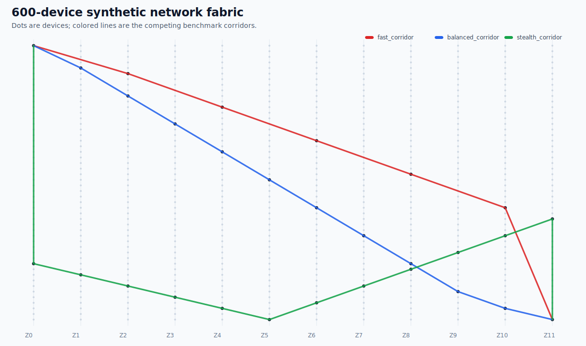
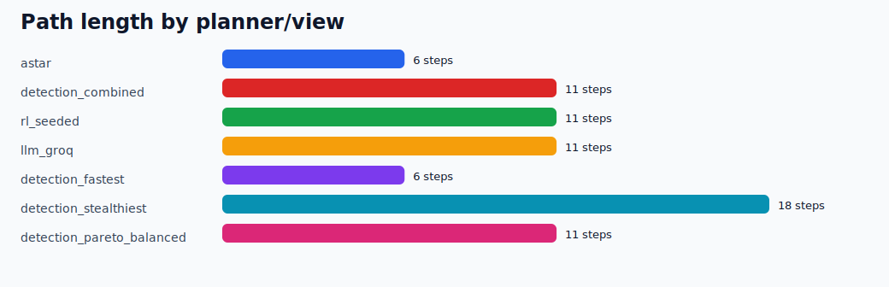
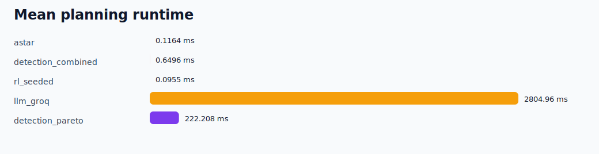
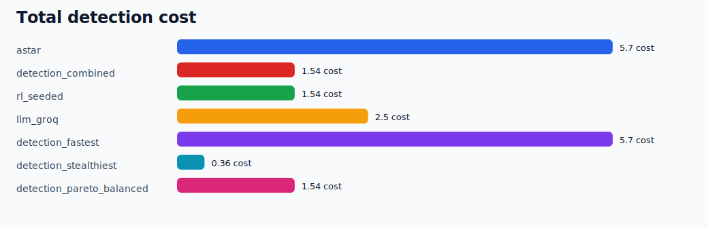

# Huge 600-Device Benchmark

Synthetic, local-only benchmark for comparing planner behavior on a large attack graph.

## Scale

- Devices: `600`
- Attack edges: `1603`
- Zones: `12`
- Start: `10.60.0.1`
- Goal: `10.60.11.50`
- Timing repeats per planner: `5`
- LLM backend used in this run: `groq`

## Planner Results

| Planner/view | Steps | Exploit cost | Detection cost | Combined cost | Mean planning time |
|---|---:|---:|---:|---:|---:|
| `astar` | 6 | 1.2 | 5.7 | 29.1 | 0.179 ms |
| `detection_combined` | 11 | 14.3 | 1.54 | 14.85 | 0.6222 ms |
| `rl_seeded` | 11 | 14.3 | 1.54 | 14.85 | 0.1502 ms |
| `llm_groq` | 10 | 23.1 | 2.5 | 24.05 | 2242.9294 ms |
| `detection_fastest` | 6 | 1.2 | 5.7 | 29.1 | 90.3948 ms |
| `detection_stealthiest` | 18 | 45.0 | 0.36 | 24.3 | 90.3948 ms |
| `detection_pareto_balanced` | 11 | 14.3 | 1.54 | 14.85 | 90.3948 ms |

Live Groq timing is intentionally sampled once even when the other planners use repeated local timing runs.
Live Groq path selection is also nondeterministic, so a fresh rerun may choose a different valid route through the same reduced prompt subgraph.

## Visuals

## Files

- `huge_graph.pkl`: generated graph
- `qtable.pkl`: deterministic learned-policy table for the RL planner
- `benchmark_summary.json`: complete metrics
- `commands.md`: reproducible commands
- `paths/*.json`: selected paths per planner/view
- `dashboard.html`: self-contained static report
